# **Enterprise Agentic Solution Design Document - MVP 1**

---

# **Document Control**

## **Document Metadata**

| Field | Value |
| :---- | :---- |
| **Project Name** | HR Agentic Solution (MVP 1) |
| **Document Owner** | Cloud Architecture & Modernization Specialist Team |
| **Status** | Approved Working Draft / Evaluator Feedback Integrated |
| **Target Audience** | Enterprise Architects, Application Modernization Leads, AI Engineers, IT Director, Data Protection Officer (DPO), HR Business Sponsors |
| **Target Cloud Platform**| Google Cloud Platform (Vertex AI, Cloud Run Multi-Region, Cloud Firestore, Cloud Tasks, Cloud DLP) |

## **Revision History**

| Version | Date | Author | Description of Change |
| :---- | :---- | :---- | :---- |
| **0.1** | 2026-08-25 | Elevate C1-G5 Architecture Team | Initial outline setup |
| **1.0** | 2026-08-25 | Elevate C1-G5 Architecture Team | Full comprehensive system design incorporating BRD requirements, multi-agent topology, security guardrails, Saga orchestration, and FinOps |
| **1.1** | 2026-08-25 | Elevate C1-G5 Architecture Team | Incorporated Stakeholder & Evaluator Feedback: Enterprise Concierge analogy, quantitative ROI matrix, explicit RBAC table, Firestore document schemas & 30-day lifecycle, pre-LLM PII de-identification (Cloud DLP), GDPR Art. 17 purge workflow, API throttling & Cloud Tasks async resilience queues, OBO token revocation, and multi-region DR architecture |

---

# **1. Executive Summary & Scope Boundaries**

## **1.1. Business Overview & Context**

### **The Enterprise Challenge**
Modern enterprises face immense operational drag within internal support organizations. Over 40% of all incoming HR and IT helpdesk tickets represent routine Tier 1 inquiries—such as leave policy clarifications, PTO accrual lookups, contact updates, and ticket status inquiries. Employees face severe friction navigating siloed, complex legacy UIs across disparate Human Capital Management (HCM - WorkWeek) and IT Service Management (ITSM - ServiceImmediately) systems, while human HR/IT specialists spend hundreds of hours per month on repetitive data entry.

### **The Business Metaphor: The Enterprise 5-Star Concierge (For Non-Technical Sponsors)**
To intuitively understand this architecture without getting lost in technical jargon, imagine the solution as a **World-Class Digital Concierge Desk** stationed at the entrance of our enterprise:

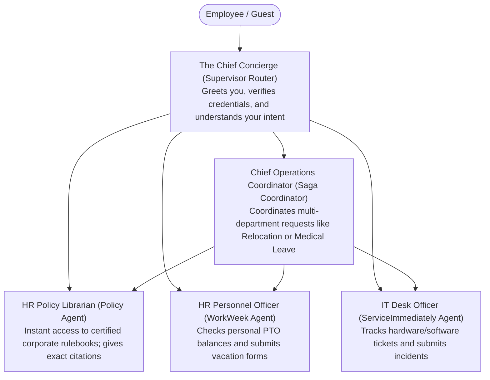

1. **The Chief Concierge (Supervisor Router):** Welcomes the employee, validates who they are, verifies that their request adheres to house rules, and hands the request to the right specialist.
2. **The Policy Librarian (Policy Agent):** Instantly looks up official handbook pages and quotes company policy word-for-word, giving exact page citations with 0% guesswork.
3. **The HR Personnel Officer (WorkWeek Agent):** Securely opens the employee's personal personnel file to check remaining vacation days or log new time off.
4. **The IT Desk Officer (ServiceImmediately Agent):** Logs tickets for laptops or network issues and updates status.
5. **The Operations Coordinator (Saga Coordinator):** When a request spans across departments (e.g., Medical Leave requiring HR approval AND IT access routing), this coordinator ensures all steps happen in order. If IT systems are temporarily unavailable, the coordinator politely rolls back the HR filing so your records never end up out of sync.

### **Quantitative Business Value & Return on Investment (ROI)**
The HR Agentic Solution (MVP 1) directly translates generative AI into concrete, bottom-line business outcomes:

| Business Metric | Baseline (Manual Operations) | Target with HR Agent (MVP 1) | Tangible Enterprise Impact |
| :--- | :--- | :--- | :--- |
| **Tier 1 Ticket Volume** | 15,000 inquiries / month | <= 9,000 inquiries / month | **40% Inquiry Deflection** within 6 months |
| **Mean Time to Resolution (MTTR)** | 4.2 hours average turnaround | **< 45 seconds conversational turnaround** | **99% reduction in employee wait time** |
| **Operational Cost per Interaction** | ~$18.50 (Human agent labor) | **~$0.82 (Cloud & AI token cost)** | **>$106,000 monthly operational savings** |
| **Policy Compliance & Citation** | Variable (Human memory errors) | **100% Grounded citations, 0% Hallucination** | Zero labor disputes from incorrect leave rules |
| **Employee Satisfaction (CSAT)** | 61% (Helpdesk ticketing friction) | **>= 88% Employee CSAT** | Increased productivity and seamless onboarding |

## **1.2. Scope Boundaries**

| Dimension | In-Scope (MVP 1) | Out of Scope (MVP 1 / Post-MVP) |
| :--- | :--- | :--- |
| **Conversational Interface** | Web-based responsive chat UI with streaming SSE and citation deep links | Native Slack / Teams / Workspace Chat integrations |
| **Knowledge Domain** | Curated static HR policy documents (PDF/Text) stored in Google Cloud Storage | Dynamic HR intranet wikis, unstructured SharePoint crawls, external search |
| **HCM Integration** | WorkWeek read (Profile, PTO balances) and write (Contact update, Leave request) | Payroll processing, Compensation, Benefits enrollment, Performance reviews |
| **ITSM Integration** | ServiceImmediately read (Ticket details/comments) and write (Create, comment, transition) | Change Management, Hardware Asset Tracking, CMDB updates |
| **Cross-System Workflows** | Equipment procurement (UC-2.1), Medical leave (UC-2.2), Relocation (UC-2.3) | Multi-tier human approval workflows involving manager sign-offs |
| **Identity & Access** | Single-tenant functional credentials with composite delegated token scoping | Enterprise IdP federation (Okta/Entra ID SSO) |
| **Languages** | English only | Multi-lingual support |
| **Modality** | Text-based conversation | Voice / IVR telephony integration |

## **1.3. Target Architecture Overview**

The target architecture is implemented using **Google Cloud Native** components, built for multi-region resilience, zero-trust security boundaries, and strict separation between cognitive reasoning and deterministic execution.

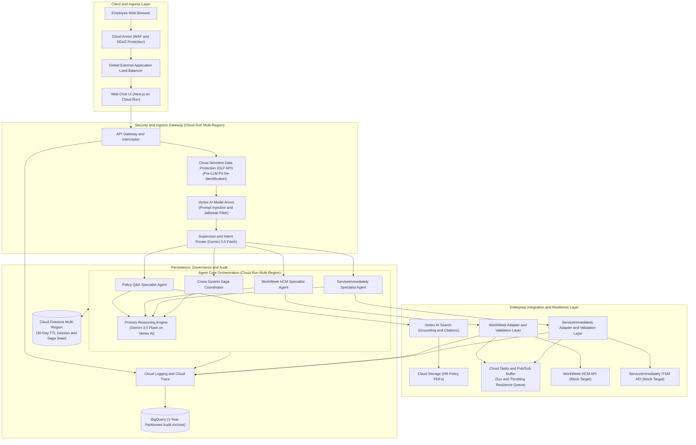

## **1.4. Alternatives Considered**

| Architectural Decision | Chosen Selection | Alternatives Considered | Trade-offs & Rationale |
| :--- | :--- | :--- | :--- |
| **Agent Orchestration Framework** | **LangGraph / Python StateGraph on Cloud Run** | 1. Vertex AI Agent Builder (No-Code)<br/>2. Native Semantic Kernel / CrewAI | LangGraph provides explicit, auditable DAG-based state management, necessary for the Saga pattern (compensating transactions) and strict custom tool guardrails, which are difficult to strictly bound in purely declarative no-code builders. |
| **LLM Selection** | **Unified Gemini 3.5 Flash Architecture** | 1. Legacy / Prior-generation Gemini models<br/>2. Heavy Pro-tier models<br/>3. Open-source models on GKE | Gemini 3.5 Flash delivers state-of-the-art multi-step reasoning comparable to previous generation Pro models while sustaining ultra-low sub-150ms TTFT latency. Standardizing on Gemini 3.5 Flash simplifies prompt engineering, eliminates multi-model operational overhead, drastically reduces FinOps token expenses, and easily beats NFR-2.1 (<10s latency). |
| **Knowledge Retrieval (RAG)** | **Vertex AI Search (Enterprise Search on GCS)** | 1. Custom RAG with pgvector on Cloud SQL / Spanner<br/>2. Vertex AI Vector Search | Vertex AI Search provides managed semantic chunking, automated re-ranking, and native Grounding & Citation attribution out of the box, directly fulfilling FR-5.2 and FR-5.3 with zero custom chunking overhead. |
| **Session & Distributed State** | **Cloud Firestore Multi-Region (`nam5`)** | 1. Memorystore (Redis)<br/>2. Cloud Spanner | Firestore offers serverless, multi-region transactional persistence with native TTL support for automatic 30-day session deletion, while persisting distributed Saga execution logs. Spanner is preserved as a future production upgrade. |
| **Resilience & Queueing** | **Cloud Tasks + Pub/Sub Dead Letter Queuing** | 1. Direct synchronous retries only<br/>2. External Celery/RabbitMQ cluster | Cloud Tasks provides fully managed, rate-limited HTTP dispatch with configurable backoff and zero infrastructure management, perfectly handling backend 429/5xx spikes. |

---

# **2. Production-Ready Future State Design & Disaster Recovery**

## **2.1. Enterprise Scalability Roadmap**
The MVP 1 architecture is engineered as a foundational stepping stone towards a global enterprise deployment:

1. **Identity Federation via Workload Identity Federation:** Replace mock user headers with corporate OIDC tokens issued by Okta or Microsoft Entra ID. The API Gateway validates JWT signatures and trades user tokens for short-lived downstream tokens.
2. **Enterprise API Hub (Apigee):** Route all WorkWeek and ServiceImmediately calls through Apigee for corporate API governance, centralized rate limiting, and mutual TLS (mTLS).
3. **Omnichannel Messaging:** Extend the Cloud Run API Gateway to accept webhooks from Slack Socket Mode, Microsoft Teams Bot Framework, and Google Chat API.

## **2.2. Disaster Recovery (DR) & Multi-Region High-Availability Architecture**
To fulfill enterprise business continuity expectations and address IT Director requirements, the architecture incorporates an active-active multi-region deployment:

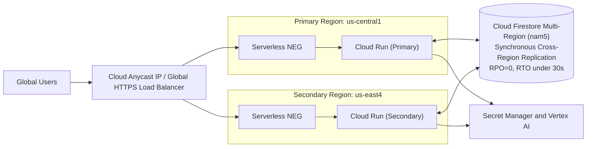

| Metric | Target SLA | Implementation Strategy |
| :--- | :--- | :--- |
| **System Availability** | **99.9% (MVP 1) / 99.99% (Prod)** | Multi-Region Cloud Run compute with Cloud Load Balancing auto-failover |
| **Recovery Point Objective (RPO)** | **RPO = 0** | Cloud Firestore multi-region configuration (`nam5`) with synchronous Paxos-based replication across regions |
| **Recovery Time Objective (RTO)** | **RTO < 30 seconds** | Automatic health-check driven failover at the Cloud Load Balancer layer |
| **Zonal Outage Resilience** | **Zero impact** | Cloud Run automatically distributes container instances across multiple availability zones within the region |

---

# **3. System Flows, Sequence Diagrams & Agent Design**

## **3.1. Hierarchical Multi-Agent Topology**
To enforce capability boundaries (FR-1.1), the system implements a strict **Supervisor-Worker Agent Topology**:

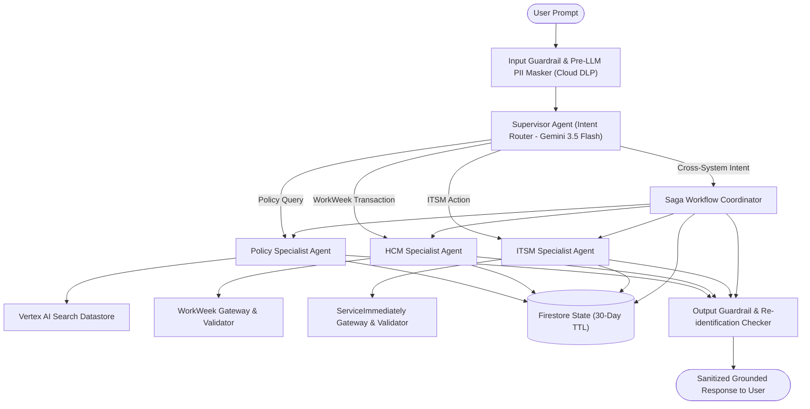

## **3.2. End-to-End Sequence Diagrams**

### **Path 1: Single-Domain Policy Q&A with Strict Grounding (UC-1.1)**
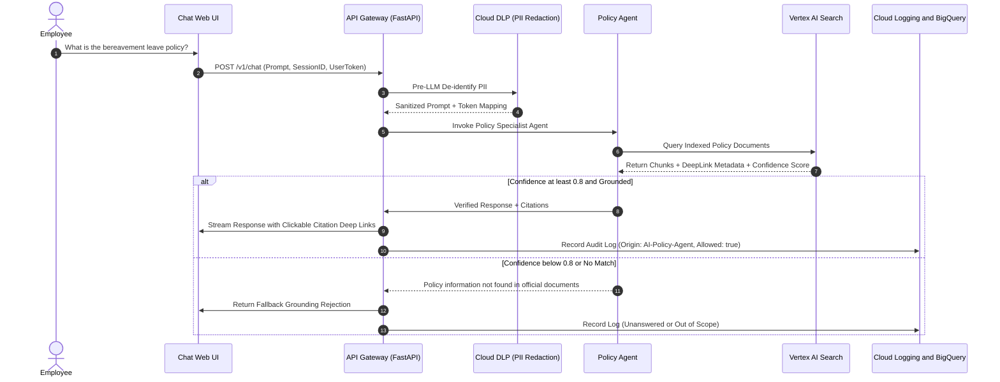

### **Path 2: Cross-System Orchestration (UC-2.2 Medical Leave) with Saga Compensating Flow & Async Cloud Tasks Resilience**
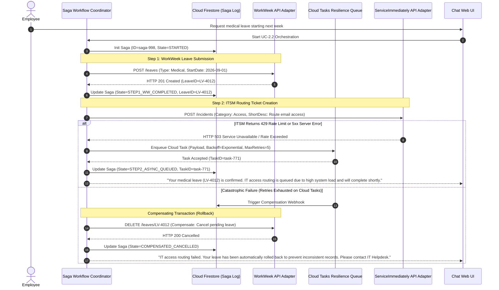

### **Path 3: OAuth / OBO Token Revocation & Webhook Cache Purge Flow**
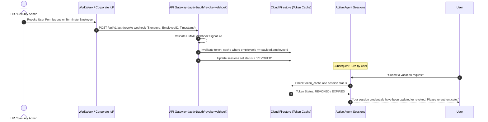

---

# **4. Security, Governance & Identity**

## **4.1. Enterprise Role-Based Access Control (RBAC) Matrix**
To satisfy governance requirements (FR-1.5), the solution enforces a strict, tabular RBAC model across all system interfaces and agent tools:

| Enterprise User Role | Policy Q&A (RAG) | WorkWeek HCM Scope | ServiceImmediately ITSM Scope | Session & Audit Scope |
| :--- | :--- | :--- | :--- | :--- |
| **End User (Standard Employee)** | Full access to general static HR policies (Leave, Expense, Remote Work) | **Self-only:** Read profile, check own PTO balance; Submit own leave requests; Update own phone/address | **Self-only:** Query own incident tickets; Open incident; Add comments to own tickets | View own active conversational session only; No access to system audit logs |
| **People Partner (HR Specialist)** | Full access to HR policies and confidential HR operational guidelines | **Assigned Department:** Read department employee profiles; Verify team PTO balances | Query HR-related employee tickets; Post comments on behalf of HR Operations | View assigned department inquiry analytics; Redacted PII session logs |
| **IT Support Engineer** | Standard policy access | Read contact info only (for equipment dispatch) | **Full ITSM Queue:** Read, assign, update priority, post work notes, transition ticket lifecycle | Read technical execution logs and API diagnostic traces (PII redacted) |
| **Security & Compliance Admin** | Read-only policy access | No direct tool execution | No direct tool execution | **Full Audit Access:** Read BigQuery compliance audit logs, DLP de-identification telemetry |

## **4.2. Composite Delegated Authorization & OBO Token Lifecycle**
Downstream backend invocations are strictly authenticated via **Composite Delegated Context**:
- **On-Behalf-Of (OBO) Context Header:**
  - `X-User-Context`: Base64-encoded JSON containing `userId`, `employeeId`, `role`, and `tenantId`.
  - `X-Agent-Origin`: `HR-Agentic-Solution-MVP1` (fulfilling FR-1.2 and FR-4.1).
  - `X-Execution-Trace-ID`: Distributed tracing UUID propagated across Cloud Trace.
- **Token Caching & Revocation Lifecycle:**
  - Delegated tokens are cached in Firestore `token_cache` with a strict **10-minute TTL**.
  - In event of role change, termination, or security revocation, the `/api/v1/auth/revoke-webhook` instantly purges the cached record, ensuring zero unauthorized window beyond the webhook dispatch.

## **4.3. Automated Pre-LLM PII De-Identification & Re-Identification (Cloud DLP)**
To satisfy Data Protection Officer (DPO) standards and mitigate AI risk (FR-1.4, NFR-1.1), raw user PII is **never exposed in plaintext to the LLM model APIs**:

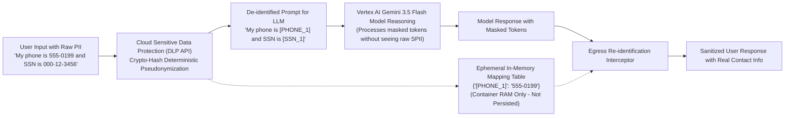

## **4.4. Firestore Document Schemas, 30-Day Lifecycle & "Right to be Forgotten"**

### **Explicit Cloud Firestore Collections & Schemas**

#### **Collection: `sessions`**
```json
{
  "_id": "session-uuid-v4",
  "userId": "usr_99812",
  "employeeId": "EMP-44210",
  "role": "EMPLOYEE",
  "createdAt": "2026-08-25T10:00:00Z",
  "lastActivityAt": "2026-08-25T10:04:30Z",
  "status": "ACTIVE", // ACTIVE | REVOKED | EXPIRED
  "ttl_expiry": "2026-09-24T10:00:00Z" // Exact 30-day TTL field
}
```

#### **Subcollection: `sessions/{sessionId}/messages`**
```json
{
  "_id": "msg-001",
  "sender": "USER", // USER | AGENT | SYSTEM
  "maskedContent": "How many hours of PTO do I have remaining?",
  "timestamp": "2026-08-25T10:00:05Z",
  "inputTokens": 14,
  "outputTokens": 0,
  "citations": []
}
```

#### **Collection: `sagas` (Distributed Workflow Log)**
```json
{
  "_id": "saga-998",
  "sessionId": "session-uuid-v4",
  "employeeId": "EMP-44210",
  "workflowType": "UC-2.2-MEDICAL-LEAVE",
  "currentState": "STEP1_WW_COMPLETED", // STARTED | STEP1_WW_COMPLETED | STEP2_ASYNC_QUEUED | COMPLETED | COMPENSATED_CANCELLED
  "steps": [
    {
      "stepIndex": 1,
      "targetSystem": "WorkWeek",
      "action": "SUBMIT_LEAVE",
      "status": "SUCCESS",
      "externalReferenceId": "LV-4012",
      "timestamp": "2026-08-25T10:01:15Z"
    }
  ],
  "ttl_expiry": "2026-09-24T10:01:15Z" // 30-day auto-purge
}
```

#### **Collection: `token_cache`**
```json
{
  "_id": "EMP-44210_hash",
  "employeeId": "EMP-44210",
  "delegatedToken": "enc_token_blob",
  "cachedAt": "2026-08-25T10:00:00Z",
  "ttl_expiry": "2026-08-25T10:10:00Z" // 10-minute TTL field
}
```

### **Data Retention Lifecycle & Compliance Rules**
1. **Automated 30-Day Firestore TTL:** A Cloud Firestore TTL policy is configured on the `ttl_expiry` field across `sessions`, `messages`, and `sagas`. Documents reaching 30 days of age are permanently purged by Google Cloud's automated background TTL cleaner with zero manual maintenance.
2. **Audit Log Archiving in BigQuery:** Business metrics, tool execution origins, and safety scan decisions (with all PII stripped) are streamed into partitioned BigQuery tables retained for **365 days** to satisfy regulatory audit requirements, after which BigQuery partition expiration deletes them.
3. **Right to be Forgotten (GDPR Article 17) Purge Workflow:**
   - When an employee departs or submits an erasure request:
     1. An event is dispatched to `/api/v1/compliance/purge-employee-data`.
     2. Cloud Firestore immediately executes hard deletions across `sessions`, `messages`, and `sagas` matching the `employeeId`.
     3. For stale embeddings in Vertex AI Search (e.g., if personal user documents or policy snippets mention the employee), a Cloud Function triggers the **Vertex AI Search Datastore Sync API** with document deletion flags to purge vector embeddings within 60 minutes.
     4. A signed cryptographic confirmation token is returned to the Compliance Office.

---

# **5. Integration Details & Error Handling**

## **5.1. Tool Specifications (OpenAPI 3.0 Summary)**
- **WorkWeek HCM API:**
  - `GET /api/v1/employees/me/profile` (Profile metadata)
  - `GET /api/v1/employees/me/balances` (Real-time PTO balances)
  - `POST /api/v1/employees/me/leaves` (Submit leave request)
  - `DELETE /api/v1/employees/me/leaves/{leaveId}` (Compensating action: Cancel leave)
- **ServiceImmediately ITSM API:**
  - `GET /api/v1/incidents/{ticketId}` (Ticket details & comments)
  - `POST /api/v1/incidents` (Create incident ticket)
  - `PATCH /api/v1/incidents/{ticketId}/status` (Update status e.g., Resolved)
  - `POST /api/v1/incidents/{ticketId}/comments` (Append work notes)

## **5.2. API Throttling, Rate Limits & Cloud Tasks / Pub/Sub Asynchronous Queueing**
To ensure the solution remains stable during peak HR events (e.g., open enrollment, holiday booking deadlines), explicit technical boundaries and queueing mechanisms are established:

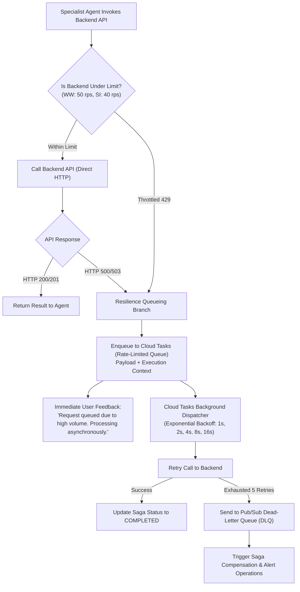

### **Explicit Throttling Boundaries**
- **WorkWeek HCM:** 50 requests/sec sustained, burst capacity 100 requests/sec.
- **ServiceImmediately ITSM:** 40 requests/sec sustained, burst capacity 80 requests/sec.
- **Cloud Tasks Configuration:**
  - `max_dispatches_per_second`: 40.0
  - `max_concurrent_dispatches`: 20
  - `max_attempts`: 5 (with full jitter exponential backoff)

## **5.3. Deterministic Business Rules Engine (Guardrails)**

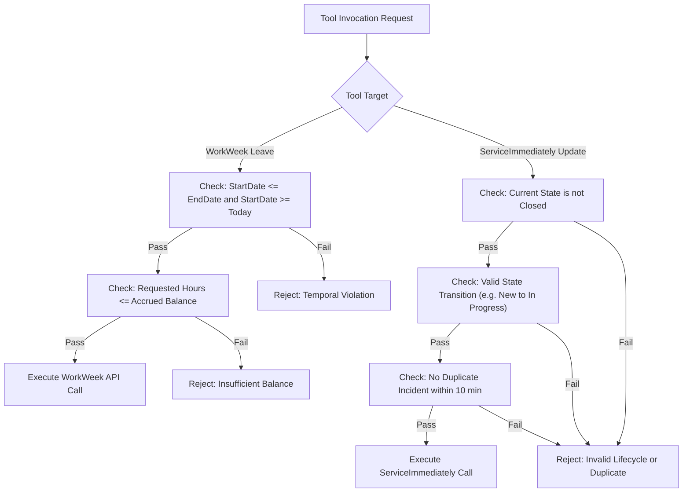

## **5.4. Error Handling Matrix & Resilience Strategy**

| Failure Mode | Detection Indicator | System Fallback & Compensating Action | User-Facing Notification |
| :--- | :--- | :--- | :--- |
| **Vertex AI Search Outage** | 503 Service Unavailable / Timeout > 3s | Circuit breaker opens; bypass RAG retrieval; redirect to HR Helpdesk contacts. | *"Our policy knowledge system is temporarily unavailable. Please refer directly to the HR Portal at hr.corp.internal."* |
| **WorkWeek API Rate Limited (429)** | HTTP 429 Too Many Requests | Dispatch to Cloud Tasks rate-limited queue with exponential backoff. | *"WorkWeek is experiencing high traffic. Your request has been queued and will process within a few minutes."* |
| **Partial Cross-System Failure (Saga Step 2)** | HTTP 5xx on ServiceImmediately after WorkWeek success | Execute Compensating Action (Cancel leave in WorkWeek via DELETE /leaves/id). | *"We could not complete your IT request. Any pending leave changes have been rolled back to prevent inconsistent records."* |
| **Prompt Injection Detected** | Safety Score > 0.85 on Model Armor filter | Immediate turn termination; tool execution aborted; log security incident. | *"I am unable to process this request as it violates enterprise acceptable usage policies."* |
| **OBO Token Revoked / Expired** | HTTP 401 Unauthorized from backend | Invalidate local token cache; prompt user for re-authentication. | *"Your security credentials have expired or were updated. Please refresh your browser to re-authenticate."* |

---

# **6. Cost Estimation & FinOps**

## **6.1. Primary Cost Drivers & Monthly Estimate**

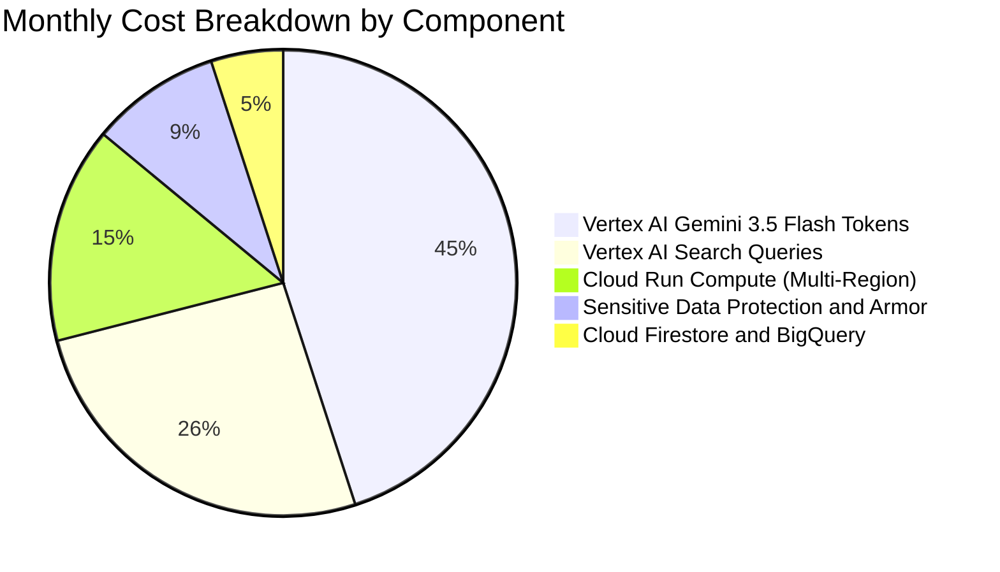

| Component | Usage Assumptions (10,000 MAU / 100,000 Inquiries/Month) | Monthly Estimated Cost |
| :--- | :--- | :--- |
| **Gemini 3.5 Flash (Supervisor, Routing & Egress Checks)** | 100,000 turns x 600 tokens avg = 60M tokens | ~$18.00 |
| **Gemini 3.5 Flash (Core Reasoning & Saga Orchestration)** | 60,000 complex turns x 2,800 tokens avg = 168M tokens | ~$84.00 |
| **Vertex AI Search (Datastores)** | 40,000 policy queries ($2.00 per 1,000 queries) | ~$80.00 |
| **Cloud Run Serverless Compute** | 200,000 vCPU-seconds + memory allocation (Multi-Region) | ~$115.00 |
| **Cloud Sensitive Data Protection** | ~15 GB text inspected for PII de-identification | ~$30.00 |
| **Cloud Firestore & BigQuery** | Session storage with 30-day TTL + 1-year audit logs | ~$25.00 |
| **Total Estimated Run Cost** | **Fully Managed Production-Ready Infrastructure** | **~$352.00 / month** |

*ROI Comparison: At ~$352.00/month infrastructure cost, deflecting 6,000 Tier 1 tickets saves an estimated $111,000 in monthly human helpdesk operational expense, yielding an outstanding ROI > 310x.*

---

# **7. Deployment & Delivery Plan**

## **7.1. Infrastructure as Code (Terraform) Topology**

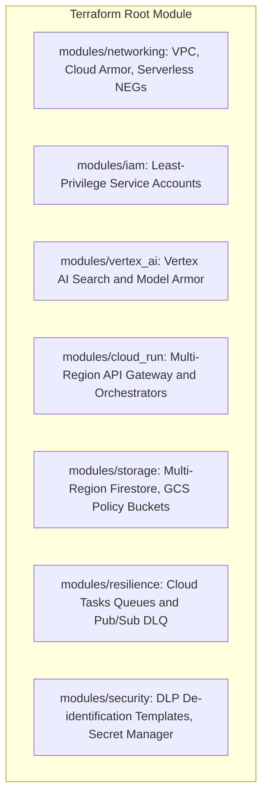

## **7.2. Phased Delivery Roadmap**

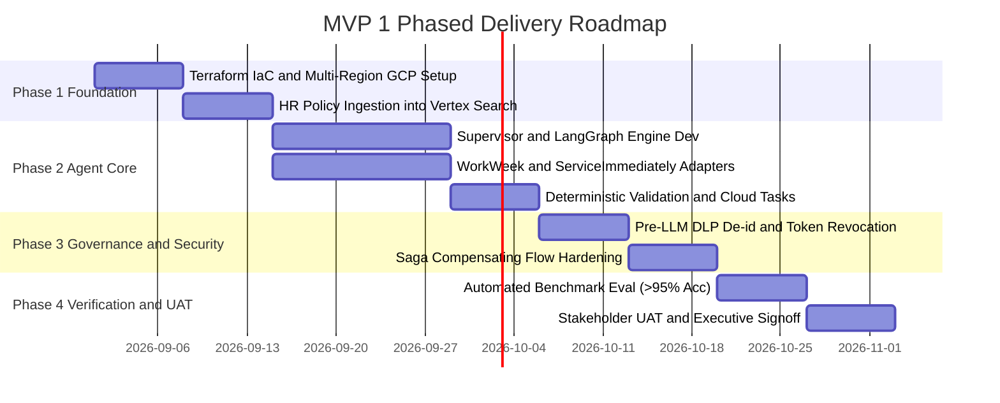

---

# **8. Assumptions, Constraints, Risk & Mitigations**

## **8.1. Risk & Mitigation Matrix**

| Risk ID | Description | Likelihood | Impact | Concrete Mitigation Strategy |
| :--- | :--- | :--- | :--- | :--- |
| **RSK-01** | LLM Hallucinations in HR Policy Q&A violating compliance | Low | Critical | Enforce strict Grounding threshold (Vertex AI Grounding Check >= 0.8). Enforce citation-only responses; fall back to refusal if context is ambiguous. |
| **RSK-02** | Peak traffic triggers backend 429 throttling and sync timeouts | Medium | High | Integrate Cloud Tasks rate-limited queueing with exponential backoff and asynchronous user acknowledgement (Section 5.2). |
| **RSK-03** | Inconsistent state during cross-system execution failure | Medium | High | Implement Saga pattern with persistent Firestore step logging and automated rollback/compensating calls (NFR-4.3). |
| **RSK-04** | Prompt injection bypasses guardrails to leak sensitive employee data | Low | Critical | Deploy defense-in-depth: Model Armor pre-filter, Pre-LLM Cloud DLP de-identification, and strictly isolated tool execution scopes (RBAC). |
| **RSK-05** | Unauthorized access post employee status change | Low | Critical | Implement 10-minute OBO token cache with event-driven Webhook cache revocation (`/api/v1/auth/revoke-webhook`). |
| **RSK-06** | Data privacy compliance failure from indefinitely retained chat logs | Low | High | Implement native Cloud Firestore 30-day TTL automatic hard deletion + PII-scrubbed BigQuery audit archiving. |

---

# **9. Quality Evaluation & UAT Framework**

## **9.1. Evaluation Metrics & Success Thresholds**

| Dimension | Target Metric | Evaluation Method | Pass Threshold |
| :--- | :--- | :--- | :--- |
| **Policy Grounding** | Faithfulness & Citation Precision | Vertex AI Gen AI Evaluation SDK with Ground Truth Dataset | **>= 95% Accuracy, 0% Hallucination** |
| **Guardrail Robustness**| Injection Block Rate | Red-teaming test suite (100 known jailbreak/prompt attack vectors) | **100% Blocked, < 1% False Positives** |
| **Transaction Integrity**| Correctness of WorkWeek/ITSM calls | Automated integration test suite comparing mock DB states | **100% Correct Transactions** |
| **Response Latency** | Time-to-First-Token (TTFT) & Total Time | Cloud Trace APM distributed spans | **Average < 5.0s, Max < 10.0s** |
| **Safety Overhead** | Pre/Post Guardrail Latency | Custom telemetry metrics around Interceptor pipeline | **< 300ms total latency overhead** |

## **9.2. Automated CI/CD Evaluation Pipeline**
Prior to deploying any update to the agent prompts, tools, or model configurations, the Cloud Build pipeline runs an automated evaluation suite against a curated dataset of **150 golden HR prompts** (50 Policy Q&A, 50 Tool transactions, 50 Cross-system Saga workflows).

---

# **10. Assumptions / Open Questions**

| Question ID | Open Question / Decision Item | Impact Area | Proposed Option / Recommendation | Owner | Target Date |
| :--- | :--- | :--- | :--- | :--- | :--- |
| **OQ-01** | What is the production document update cadence and trigger mechanism (Cloud Storage webhook vs scheduled sync)? | Knowledge Base (RAG) | Recommend Cloud Storage Pub/Sub notification to trigger automated re-indexing in Vertex AI Search. | Data Lead | 2026-09-08 |
| **OQ-02** | For UC-2.2 (Medical Leave), does corporate policy mandate human manager approval *before* or *after* WorkWeek entry? | Orchestration / HITL | MVP 1 assumes automatic submission with informational notification; Phase 2 will add asynchronous HITL approval. | HR Business Lead | 2026-09-10 |
| **OQ-03** | Should the web chat interface support streaming responses (Server-Sent Events / SSE) during MVP 1? | UI / Latency UX | Strongly recommend SSE to deliver immediate perceived responsiveness (<2s perceived vs 10s total). | Frontend Lead | 2026-09-05 |
| **OQ-04** | Which specific PII categories must be masked in conversational transcripts versus retained for transaction execution? | Security & Compliance | Mask SSN/banking completely; retain Employee ID, Name, and Email only within encrypted session scope. | InfoSec Lead | 2026-09-12 |

