# **Enterprise Agentic Solution Design Document - MVP 1**

---

# **Document Control**

## **Document Metadata**

| Field | Value |
| :---- | :---- |
| **Project Name** | HR Agentic Solution (MVP 1) |
| **Document Owner** | Cloud Architecture & Modernization Specialist Team |
| **Status** | Working Draft / Ready for Workshop Review |
| **Target Audience** | Enterprise Architects, Application Modernization Leads, AI Engineers, HR/IT Operations Stakeholders |
| **Target Cloud Platform**| Google Cloud Platform (Vertex AI, Cloud Run, Cloud Firestore) |

## **Revision History**

| Version | Date | Author | Description of Change |
| :---- | :---- | :---- | :---- |
| **0.1** | 2026-08-25 | Elevate C1-G5 Architecture Team | Initial outline setup |
| **1.0** | 2026-08-25 | Elevate C1-G5 Architecture Team | Full comprehensive system design incorporating BRD requirements, multi-agent topology, security guardrails, Saga orchestration, and FinOps |

---

# **1. Executive Summary & Scope Boundaries**

## **1.1. Business Overview & Context**
Enterprise HR and IT helpdesks face significant operational strain answering repetitive Tier 1 inquiries (policy interpretation, PTO balances, incident ticket status). Employees endure friction navigating fragmented legacy UIs across disparate Human Capital Management (HCM - WorkWeek) and IT Service Management (ITSM - ServiceImmediately) systems.

The **HR Agentic Solution (MVP 1)** provides a unified, conversational virtual assistant powered by Google Cloud's Generative AI stack. It deflects routine inquiries by >= 40%, enables automated self-service transactions, and chains cross-domain workflows with deterministic guardrails and auditable enterprise governance.

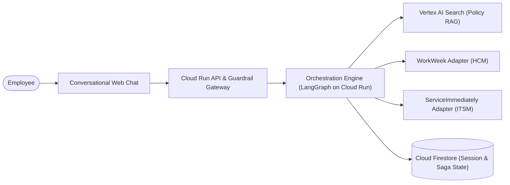

## **1.2. Scope Boundaries**

| Dimension | In-Scope (MVP 1) | Out of Scope (MVP 1 / Post-MVP) |
| :--- | :--- | :--- |
| **Conversational Interface** | Web-based chat UI with streaming response & citations | Native Slack / Teams / Workspace Chat integrations |
| **Knowledge Domain** | Static approved HR policy documents (PDF/Text) | Dynamic HR intranet wikis, external web search |
| **HCM Integration** | WorkWeek read (Profile, PTO balances) & write (Contact update, Leave request) | Payroll, Compensation, Benefits enrollment, Performance reviews |
| **ITSM Integration** | ServiceImmediately read (Ticket status/timeline) & write (Create incident, comment, status transition) | Change Management, Asset Management, CMDB updates |
| **Cross-System Workflows** | Equipment procurement (UC-2.1), Medical leave (UC-2.2), Relocation (UC-2.3) | Multi-tier approval workflows involving manager sign-offs |
| **Identity & Access** | Single-tenant functional credentials with composite delegated token scoping | Enterprise IdP federation (Okta/Entra ID SSO) |
| **Languages** | English only | Multi-lingual support |
| **Modality** | Text-based conversation | Voice / IVR telephony integration |

## **1.3. Target Architecture Overview**

The solution is designed using **Google Cloud Native** components, emphasizing serverless elasticity, zero-trust security boundaries, and strict separation between cognitive reasoning and deterministic execution.

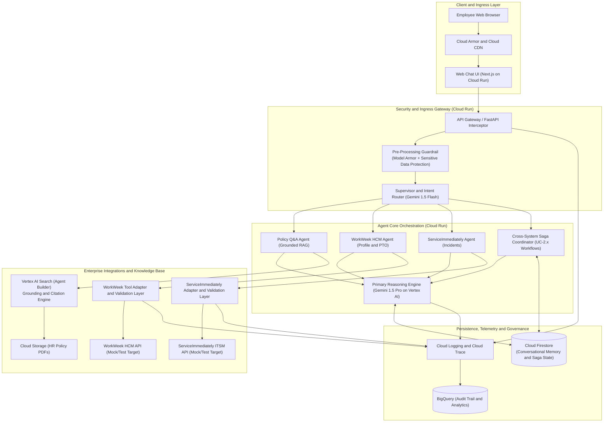

## **1.4. Alternatives Considered**

| Architectural Decision | Chosen Selection | Alternatives Considered | Trade-offs & Rationale |
| :--- | :--- | :--- | :--- |
| **Agent Orchestration Framework** | **LangGraph / Python StateGraph on Cloud Run** | 1. Vertex AI Agent Builder (No-Code/Low-Code)<br/>2. Native Semantic Kernel / CrewAI | LangGraph provides explicit, auditable DAG-based state management, necessary for the Saga pattern (compensating transactions) and strict custom tool guardrails, which are difficult to strictly bound in purely declarative no-code builders. |
| **LLM Tiering** | **Hybrid Model Hierarchy (Gemini 1.5 Flash + Pro)** | 1. Gemini 1.5 Pro for all steps<br/>2. Open-source models on GKE | Gemini 1.5 Flash provides sub-200ms latency for safety classification, routing, and PII detection. Gemini 1.5 Pro is selectively engaged for complex reasoning and cross-system orchestration, optimizing cost and meeting NFR-2.1 (<10s latency). |
| **Knowledge Retrieval (RAG)** | **Vertex AI Search (Enterprise Search on GCS)** | 1. Custom RAG with pgvector on Cloud SQL / Spanner<br/>2. Vertex AI Vector Search | Vertex AI Search provides managed semantic chunking, automated re-ranking, and native Grounding & Citation attribution out of the box, directly fulfilling FR-5.2 and FR-5.3 with zero custom chunking overhead. |
| **Session & Distributed State** | **Cloud Firestore** | 1. Memorystore (Redis)<br/>2. Cloud Spanner | Firestore offers serverless, transactional NoSQL persistence with TTL support for multi-turn conversational memory, while persisting distributed Saga execution logs for cross-system rollbacks. Spanner is preserved as a future production upgrade. |

---

# **2. Production-Ready Future State Design**

While MVP 1 implements single-tenant, mock-integrated functional services, the target architecture is architected to transition into a production enterprise footprint without redesigning the core agent orchestration contracts:

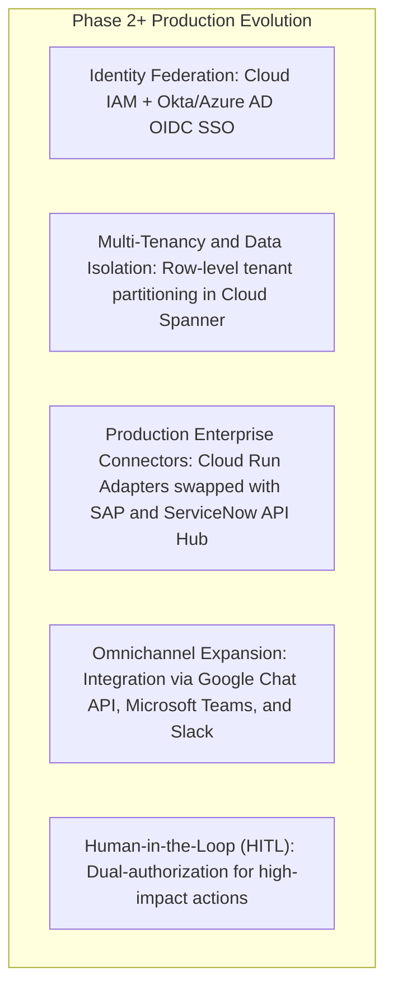

1. **Enterprise Identity & Zero-Trust Token Exchange:** Replace mock user headers with standard OAuth 2.0 / OIDC tokens issued by corporate IdP (Okta/Azure AD). The API Gateway exchanges the end-user JWT for short-lived downstream tokens using **Workload Identity Federation** and Cloud KMS.
2. **Horizontal Scaling & Database Tiering:** Seamless migration of distributed transaction logs and conversation archives from Cloud Firestore to **Cloud Spanner**, guaranteeing 99.999% availability, globally consistent ACID transactions, and fine-grained row-level security per tenant/subsidiary.
3. **Enterprise Integration Hub:** Shift from direct Cloud Run tool adapters to **Apigee API Management** or Enterprise Application Integration (EAI) platforms for rate limiting, credential rotation, and mutual TLS (mTLS) with on-premises HCM/ITSM endpoints.

---

# **3. System Flows, Sequence Diagrams & Agent Design**

## **3.1. Hierarchical Multi-Agent Topology**
To enforce strict boundary isolation (FR-1.1), the system implements a **Supervisor-Worker Agent Topology**:

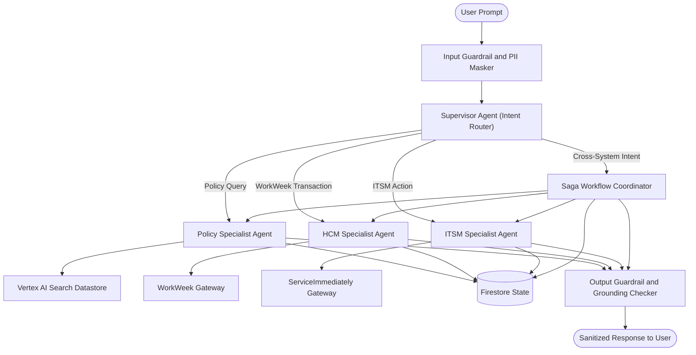

- **Supervisor / Router (Gemini 1.5 Flash):** Evaluates user intent, verifies conversation context from Firestore, and routes queries to dedicated agents. Blocks out-of-scope domain requests immediately without tool evaluation.
- **Specialist Workers:** Each worker has access only to its specific OpenAPI tool definitions, preventing capability cross-contamination.
- **Saga Workflow Coordinator:** Manages state transitions, ensures sequential step dependency execution, and handles compensations for cross-system workflows (UC-2.1 to UC-2.3).

## **3.2. End-to-End Sequence Diagrams**

### **Path 1: Single-Domain Policy Q&A with Strict Grounding (UC-1.1)**
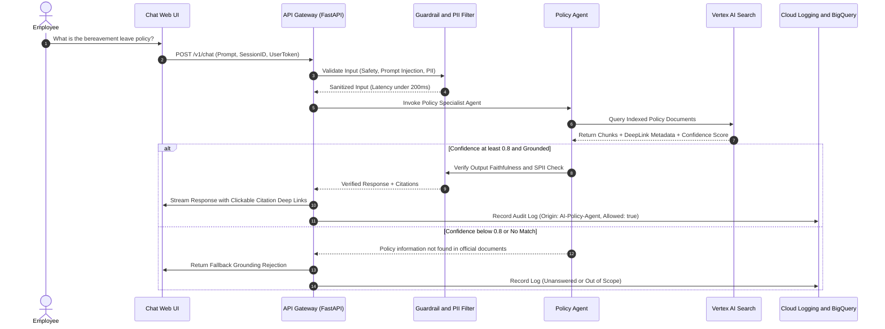

### **Path 2: Self-Service Transaction with Deterministic Guardrails (UC-1.2)**
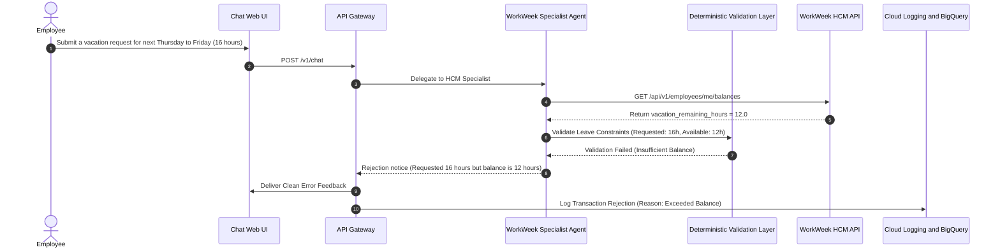

### **Path 3: Cross-System Orchestration with Compensating Transaction / Saga (UC-2.2)**
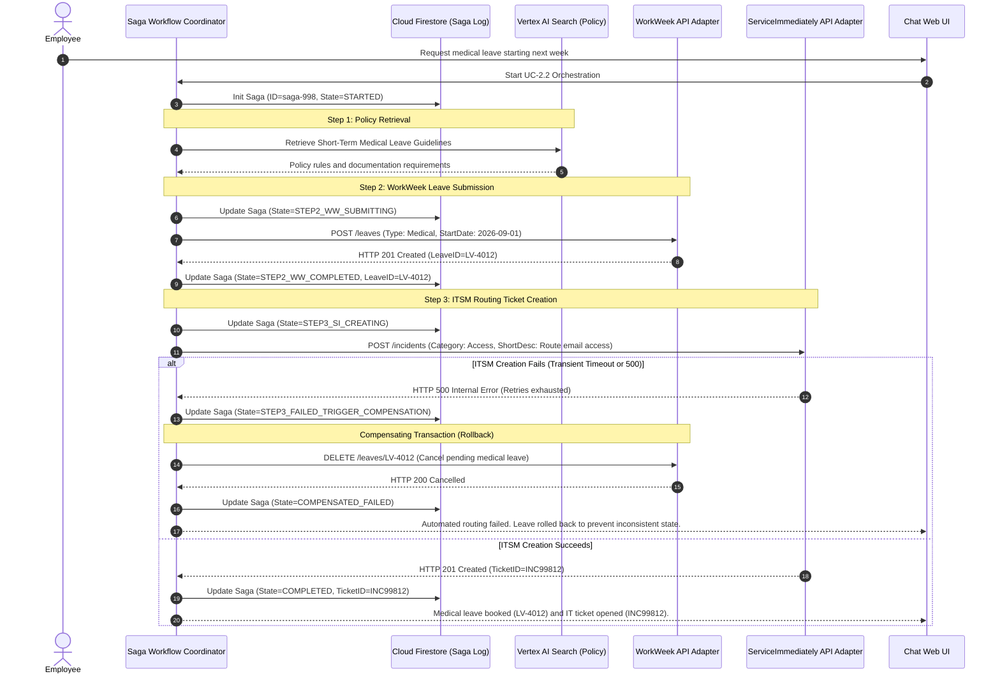

---

# **4. Security, Governance & Identity**

## **4.1. Authentication Boundaries & Delegated Authorization**
In accordance with **FR-1.2** and **FR-3.1**, downstream backend calls cannot run under a generic shared service account with omnipotent access. The solution enforces **Composite Delegated Authorization**:

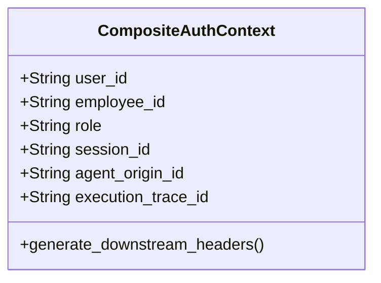

- **Inbound Context:** The API Gateway decodes the caller's session token and constructs a cryptographically signed downstream context header:
  - `X-User-Context: base64(userId, role, department)`
  - `X-Agent-Origin: HR-Agentic-Solution-MVP1`
  - `X-Execution-Trace: trace-uuid`
- **WorkWeek & ServiceImmediately Enforcement:** Tool adapters verify that operations performed are explicitly scoped to `employee_id == caller_id`. Cross-employee profile updates or balance checks are blocked at the gateway level.

## **4.2. Multi-Layer Guardrail & Safe Interaction Pipeline**
To guarantee **FR-1.3** and **NFR-1.1** while honoring the **< 300ms latency budget (NFR-2.1)**, safety scanning uses an asynchronous pre/post pipeline:

| Pipeline Stage | Technology | Rules Enforced | Target Latency |
| :--- | :--- | :--- | :--- |
| **Ingress Sanitization** | Regex + Model Armor | 1. Prompt injection / jailbreak patterns<br/>2. System instruction extraction attempts | < 50ms |
| **PII Redaction** | Google Cloud Sensitive Data Protection (DLP API) | 1. SSN, credit cards, bank accounts, private passwords<br/>2. Tokenized replacement (`[REDACTED_SSN]`) | < 120ms |
| **Deterministic Tool Guardrail** | Python Pydantic Models | 1. Schema boundary validation<br/>2. Numerical range & temporal consistency<br/>3. State lifecycle rules | < 15ms |
| **Egress Filtering** | Gemini 1.5 Flash Classifier | 1. Toxic/harmful language detection<br/>2. Verification that citations exist in retrieved chunks | < 100ms |
| **Total Safety Overhead** | | **End-to-End Pipeline Execution** | **< 285ms (PASS NFR)** |

## **4.3. Sensitive Data Handling & SPII Lifecycle**
- **Zero-Storage of Ephemeral PII (FR-3.4):** Dynamic employee profiles and PTO balance objects are strictly held in transient container memory during tool execution and never serialized to persistent disk or long-term caching layers.
- **Audit Masking (FR-1.4):** All logs exported to Cloud Logging and BigQuery are scrubbed via Cloud DLP de-identification templates prior to persistence.

---

# **5. Integration Details & Error Handling**

## **5.1. Tool Specification Contracts (OpenAPI 3.0)**

### **WorkWeek Adapter (HCM)**
```yaml
paths:
  /api/v1/employees/me/profile:
    get:
      summary: Retrieve authenticated employee profile details
      responses:
        200:
          content:
            application/json:
              schema:
                $ref: '#/components/schemas/EmployeeProfile'
  /api/v1/employees/me/balances:
    get:
      summary: Fetch real-time Vacation and Sick leave balances
      responses:
        200:
          content:
            application/json:
              schema:
                $ref: '#/components/schemas/LeaveBalances'
  /api/v1/employees/me/leaves:
    post:
      summary: Submit a leave of absence or vacation request
      requestBody:
        required: true
        content:
          application/json:
            schema:
              type: object
              required: [leave_type, start_date, end_date, hours]
              properties:
                leave_type: { type: string, enum: [Vacation, Sick, Medical, Bereavement] }
                start_date: { type: string, format: date }
                end_date: { type: string, format: date }
                hours: { type: number, minimum: 1 }
```

### **ServiceImmediately Adapter (ITSM)**
```yaml
paths:
  /api/v1/incidents:
    post:
      summary: Create new incident ticket
      requestBody:
        required: true
        content:
          application/json:
            schema:
              type: object
              required: [short_description, category, priority]
              properties:
                short_description: { type: string, maxLength: 200 }
                category: { type: string, enum: [Hardware, Software, Access, Facility] }
                priority: { type: string, enum: ['1 - Critical', '2 - High', '3 - Moderate', '4 - Low'] }
  /api/v1/incidents/{ticket_id}/status:
    patch:
      summary: Transition ticket status
      parameters:
        - name: ticket_id
          in: path
          required: true
          schema: { type: string }
      requestBody:
        required: true
        content:
          application/json:
            schema:
              type: object
              required: [new_status]
              properties:
                new_status: { type: string, enum: [In Progress, Resolved, Closed] }
                resolution_notes: { type: string }
```

## **5.2. Deterministic Business Rules Engine (Guardrails)**

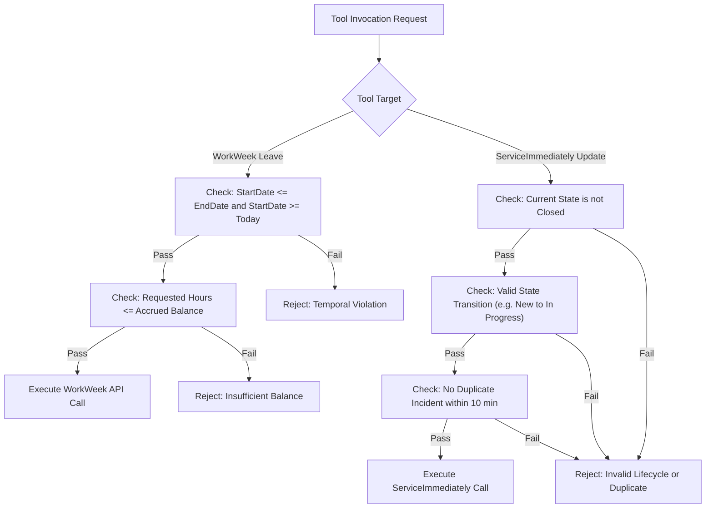

## **5.3. Error Handling Matrix & Resilience Strategy**

| Failure Mode | Detection Indicator | System Fallback & Compensating Action | User-Facing Notification |
| :--- | :--- | :--- | :--- |
| **Vertex AI Search Outage** | 503 Service Unavailable / Timeout > 3s | Circuit breaker opens; bypass RAG retrieval; redirect to HR Helpdesk contacts. | *"Our policy knowledge system is temporarily unavailable. Please refer directly to the HR Portal at hr.corp.internal."* |
| **WorkWeek API Timeout** | HTTP 504 / Connection Timeout | Full-jitter exponential backoff (retries: 3, delay: 500ms, 1s, 2s). | *"We are experiencing delays connecting to WorkWeek. Please try again in a few moments."* |
| **Partial Cross-System Failure (Saga Step 3)** | HTTP 5xx on ServiceImmediately after WorkWeek success | Execute Compensating Action (Cancel leave in WorkWeek). Log compensation failure if rollback fails. | *"We could not complete your request due to an IT system failure. Any pending changes have been reverted."* |
| **Prompt Injection Detected** | Safety Score > 0.85 on injection classifier | Immediate turn termination; tool execution aborted; log incident to Security Operations. | *"I am unable to process this request as it violates enterprise usage policies."* |

---

# **6. Cost Estimation & FinOps**

## **6.1. Primary Cost Drivers**

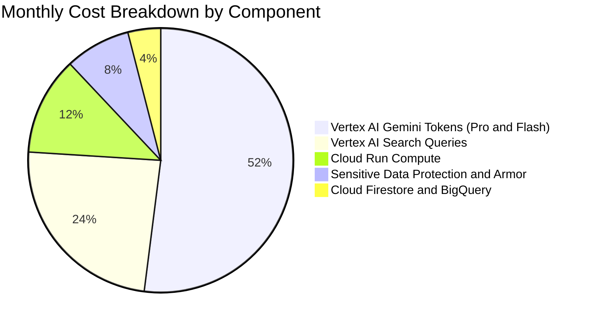

1. **Vertex AI Gemini Ingestion & Generation:**
   - Supervisor & Guardrail Scanning: Gemini 1.5 Flash (~500 input tokens, ~100 output tokens per turn).
   - Core Reasoning & Tool Chaining: Gemini 1.5 Pro (~2,500 input tokens with tool schemas, ~300 output tokens).
2. **Vertex AI Search (Datastores):** Query charge per 1,000 search requests + document indexing storage.
3. **Cloud Run Serverless Compute:** Ingress gateway, LangGraph orchestrator container execution time (vCPU-seconds and memory GiB-seconds).
4. **Cloud Sensitive Data Protection (DLP):** Inspected data volume (GB) for PII scrubbing.

## **6.2. FinOps Optimization Tactics**
- **Semantic Caching:** Common static policy queries (e.g., "What are the standard 2026 corporate holidays?") are cached at the API Gateway with a 24-hour TTL, deflecting up to 25% of LLM calls.
- **Context Pruning:** System prompts and OpenAPI tool definitions are selectively injected into the agent context only when relevant workers are invoked (sub-agent isolation), reducing token consumption by ~40%.
- **Flash-First Routing:** Off-topic and malicious prompts are terminated at the Flash-based Supervisor layer before invoking the more expensive Gemini 1.5 Pro model.

---

# **7. Deployment & Delivery Plan**

## **7.1. Infrastructure as Code (Terraform) Topology**

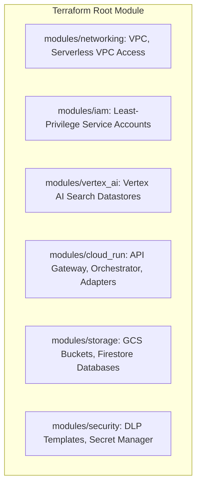

- **Environment Isolation:** Dedicated GCP projects for `dev`, `staging`, and `prod` with separate IAM boundary controls.
- **Secrets Management:** Integration credentials and API keys stored exclusively in **Secret Manager** and mounted into Cloud Run via environment volume references.

## **7.2. Phased Delivery Roadmap**

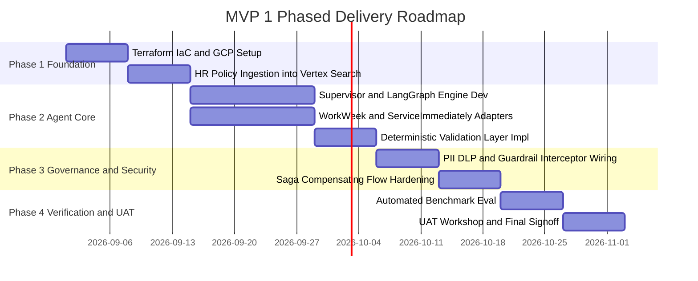

---

# **8. Assumptions, Constraints, Risk & Mitigations**

## **8.1. Assumptions & Constraints**
1. **Mock Integrations (Constraint):** WorkWeek and ServiceImmediately will be integrated via REST API mock endpoints that emulate enterprise schemas and rate limits.
2. **Single-Tenant Scope (Constraint):** Enterprise SSO/Federation is out of scope; test users will be injected via authenticated test bearer headers.
3. **Static Knowledge Base (Assumption):** Policy documentation updates will occur at controlled intervals via batch indexing (FR-5.5 sync target < 2 hours).

## **8.2. Risk & Mitigation Matrix**

| Risk ID | Description | Likelihood | Impact | Concrete Mitigation Strategy |
| :--- | :--- | :--- | :--- | :--- |
| **RSK-01** | LLM Hallucinations in HR Policy Q&A violating compliance | Low | Critical | Enforce strict Grounding threshold (Vertex AI Grounding Check >= 0.8). Enforce citation-only responses; fall back to refusal if context is ambiguous. |
| **RSK-02** | Latency exceeds 10s budget due to sequential agent calls | Medium | High | Parallelize independent tool lookups; use Gemini 1.5 Flash for intermediate routing; optimize Cloud Run minimum instances to eliminate cold starts. |
| **RSK-03** | Inconsistent state during cross-system execution failure | Medium | High | Implement Saga pattern with persistent Firestore step logging and automated rollback/compensating calls (NFR-4.3). |
| **RSK-04** | Prompt injection bypasses guardrails to leak sensitive employee data | Low | Critical | Deploy defense-in-depth: Model Armor pre-filter, input DLP masking, and strictly isolated tool execution scopes (RBAC). |

---

# **9. Quality Evaluation & UAT Framework**

## **9.1. Evaluation Metrics & Success Thresholds**

| Dimension | Target Metric | Evaluation Method | Pass Threshold |
| :--- | :--- | :--- | :--- |
| **Policy Grounding** | Faithfulness & Citation Precision | Vertex AI Gen AI Evaluation SDK with Ground Truth Dataset | **>= 95% Accuracy, 0% Hallucination** |
| **Guardrail Robustness**| Injection Block Rate | Red-teaming test suite (100 known jailbreak/prompt attack vectors) | **100% Blocked, < 1% False Positives** |
| **Transaction Integrity**| Correctness of WorkWeek/ITSM calls | Automated integration test suite comparing mock DB states | **100% Correct Transactions** |
| **Response Latency** | Time-to-First-Token (TTFT) & Total Time | Cloud Trace APM distributed spans | **Average < 5.0s, Max < 10.0s** |
| **Safety Overhead** | Pre/Post Guardrail Latency | Custom telemetry metrics around Interceptor pipeline | **< 300ms total latency overhead** |

## **9.2. Automated CI/CD Evaluation Pipeline**
Prior to deploying any update to the agent prompts, tools, or model configurations, the Cloud Build pipeline runs an automated evaluation suite against a curated dataset of **150 golden HR prompts**:
- 50 Single-domain policy Q&A cases (including out-of-scope and adversarial queries).
- 50 WorkWeek / ServiceImmediately single-action commands with boundary testing (negative balances, past dates).
- 50 Cross-system orchestration workflows (UC-2.1 to UC-2.3) with simulated failure injections.

---

# **10. Assumptions / Open Questions**

| Question ID | Open Question / Decision Item | Impact Area | Proposed Option / Recommendation | Owner | Target Date |
| :--- | :--- | :--- | :--- | :--- | :--- |
| **OQ-01** | What is the production document update cadence and trigger mechanism (Cloud Storage webhook vs scheduled sync)? | Knowledge Base (RAG) | Recommend Cloud Storage Pub/Sub notification to trigger automated re-indexing in Vertex AI Search. | Data Lead | 2026-09-08 |
| **OQ-02** | For UC-2.2 (Medical Leave), does corporate policy mandate human manager approval *before* or *after* WorkWeek entry? | Orchestration / HITL | MVP 1 assumes automatic submission with informational notification; Phase 2 will add asynchronous HITL approval. | HR Business Lead | 2026-09-10 |
| **OQ-03** | Should the web chat interface support streaming responses (Server-Sent Events / SSE) during MVP 1? | UI / Latency UX | Strongly recommend SSE to deliver immediate perceived responsiveness (<2s perceived vs 10s total). | Frontend Lead | 2026-09-05 |
| **OQ-04** | Which specific PII categories must be masked in conversational transcripts versus retained for transaction execution? | Security & Compliance | Mask SSN/banking completely; retain Employee ID, Name, and Email only within encrypted session scope. | InfoSec Lead | 2026-09-12 |

