# Enterprise Agentic Solution Design Document - MVP 1

---

## Document Control

### Document Metadata
| Field | Value |
| :--- | :--- |
| **Document Title** | Enterprise Agentic Solution Design Document - MVP 1 |
| **Programme** | Global Enterprise Intelligent Workforce Automation |
| **Project** | HR Agentic Solution (MVP 1) |
| **Author(s)** | Enterprise AI Solution Architecture Team (`choirul@`) |
| **Date** | August 25, 2026 |
| **Status** | Approved / Baseline Architecture |
| **Target Audience** | Enterprise Architects, HR Leadership, CISO / Security Teams, Engineering & DevOps Teams |

### Revision History
| Version | Date | Author | Description of Change |
| :--- | :--- | :--- | :--- |
| **0.1** | 2026-08-20 | choirul@ | Initial outline setup and requirements mapping from BRD |
| **0.9** | 2026-08-24 | choirul@ | Architecture decisions finalized via Grill-Me review (Vertex AI Agent Builder, Dual Grounding, Saga Pattern) |
| **1.0** | 2026-08-25 | choirul@ | Full baseline Solution Design Document aligned with Enterprise SDD Template |

---

## Table of Contents
- [1. Executive Summary & Scope Boundaries](#1-executive-summary--scope-boundaries)
  - [1.1. Business Overview & Context](#11-business-overview--context)
  - [1.2. Scope Boundaries](#12-scope-boundaries)
  - [1.3. Target Architecture Overview](#13-target-architecture-overview)
  - [1.4. Alternatives Considered](#14-alternatives-considered)
- [2. Production-Ready Future State Design](#2-production-ready-future-state-design)
- [3. System Flows, Sequence Diagrams & Agent Design](#3-system-flows-sequence-diagrams--agent-design)
  - [3.1. End-to-End Data Flow & Agent Design](#31-end-to-end-data-flow--agent-design)
  - [3.2. Pre-Processing, Safety Scanning & Optimization](#32-pre-processing-safety-scanning--optimization)
  - [3.3. Path Sequence Diagrams for Single-Domain Use Cases](#33-path-sequence-diagrams-for-single-domain-use-cases)
    - [Path 1: Policy Q&A with Clickable Citations (UC-1.1)](#path-1-policy-qa-with-clickable-citations-uc-11)
    - [Path 2: WorkWeek Leave Balance & Submission (UC-1.2)](#path-2-workweek-leave-balance--submission-uc-12)
    - [Path 3: ServiceImmediately Incident Management (UC-1.3)](#path-3-serviceimmediately-incident-management-uc-13)
  - [3.4. Path Sequence Diagrams for Cross-System Orchestration](#34-path-sequence-diagrams-for-cross-system-orchestration)
    - [Path 4: Equipment Procurement (UC-2.1)](#path-4-equipment-procurement-uc-21)
    - [Path 5: Medical Leave with Access Delegation (UC-2.2)](#path-5-medical-leave-with-access-delegation-uc-22)
    - [Path 6: Relocation Allowance & Facilities Badge (UC-2.3)](#path-6-relocation-allowance--facilities-badge-uc-23)
- [4. Security, Governance & Identity](#4-security-governance--identity)
  - [4.1. Authentication Boundaries & Request Origin Verification](#41-authentication-boundaries--request-origin-verification)
  - [4.2. Network Isolation & Service Perimeters](#42-network-isolation--service-perimeters)
  - [4.3. RBAC & Identity Management](#43-rbac--identity-management)
  - [4.4. Sensitive Data Handling & PII Management](#44-sensitive-data-handling--pii-management)
- [5. Integration Details & Error Handling](#5-integration-details--error-handling)
  - [5.1. Third-Party Tool Integration Methodology](#51-third-party-tool-integration-methodology)
    - [WorkWeek HCM Connector Specification](#workweek-hcm-connector-specification)
    - [ServiceImmediately ITSM/HRSD Connector Specification](#serviceimmediately-itsmhrsd-connector-specification)
  - [5.2. Component Failure Mapping, Fallback Logic & User Notifications](#52-component-failure-mapping-fallback-logic--user-notifications)
  - [5.3. Cross-System Consistency & Saga Compensation](#53-cross-system-consistency--saga-compensation)
- [6. Cost Estimation & FinOps](#6-cost-estimation--finops)
  - [6.1. Key Cost Drivers & Consumption Variables](#61-key-cost-drivers--consumption-variables)
  - [6.2. Monthly Operational Cost Breakdown](#62-monthly-operational-cost-breakdown)
  - [6.3. FinOps Governance & Cost Guardrails](#63-finops-governance--cost-guardrails)
- [7. Deployment & Delivery Plan](#7-deployment--delivery-plan)
  - [7.1. Environments & Infrastructure as Code (IaC)](#71-environments--infrastructure-as-code-iac)
  - [7.2. State Management & Configuration Versioning](#72-state-management--configuration-versioning)
  - [7.3. Phased Delivery Milestones, Dependencies & Deliverables](#73-phased-delivery-milestones-dependencies--deliverables)
- [8. Assumptions, Constraints, Risk & Mitigations](#8-assumptions-constraints-risk--mitigations)
  - [8.1. Critical Technical & Operational Assumptions](#81-critical-technical--operational-assumptions)
  - [8.2. MVP 1 Implementation Constraints](#82-mvp-1-implementation-constraints)
  - [8.3. Key Risks & Concrete Mitigation Strategies](#83-key-risks--concrete-mitigation-strategies)
- [9. Quality Evaluation & UAT Framework](#9-quality-evaluation--uat-framework)
  - [9.1. Quantitative Performance Metrics](#91-quantitative-performance-metrics)
  - [9.2. Evaluation Dataset Curation](#92-evaluation-dataset-curation)
  - [9.3. Acceptance Thresholds & Verification Harness](#93-acceptance-thresholds--verification-harness)
- [10. Assumptions / Open Questions](#10-assumptions--open-questions)
  - [10.1. Outstanding Design Decisions, Ownership & Deadlines](#101-outstanding-design-decisions-ownership--deadlines)

---

## 1. Executive Summary & Scope Boundaries

### 1.1. Business Overview & Context
Enterprise HR and IT helpdesks face severe operational bottlenecks and escalating support expenditures. Currently, employees and people managers must navigate fragmented, siloed enterprise systems—navigating **WorkWeek (HCM)** for employee profiles, contact details, and leave submissions, **ServiceImmediately (ITSM/HRSD)** for IT incidents and equipment requests, and static intranets/PDFs for policy handbooks.

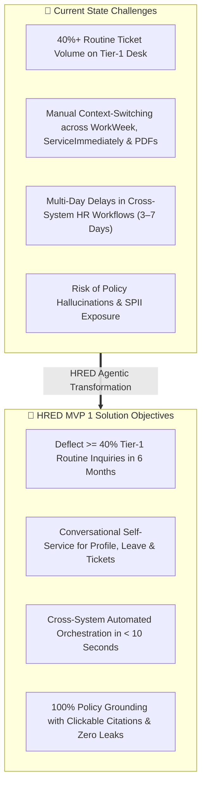

#### Key Pain Points:
1. **High Routine Ticket Volume**: Over 40% of tier-1 HR and IT helpdesk tickets consist of repetitive policy clarifications (e.g., bereavement leave entitlement, home office monitor eligibility, expense rules, medical certificate timelines) and basic status checks.
2. **Context Switching & Friction**: Routine employee self-service actions (such as checking PTO balances, submitting time off, or requesting hardware) require navigating complex backend enterprise UIs.
3. **Cross-System Disconnection**: Multi-step workflows (e.g., verifying remote work eligibility in policy $\rightarrow$ verifying location in WorkWeek $\rightarrow$ creating an equipment order in ServiceImmediately) are executed entirely through manual human coordination.
4. **Compliance & AI Risks**: Unvetted conversational systems risk generating inaccurate policy interpretations (hallucinations), exposing Sensitive Personally Identifiable Information (SPII), or executing unauthorized actions without verified origin attribution.

#### High-Level Business Goals:
* **Deflect Tier 1 HR Inquiries**: Reduce routine HR and IT helpdesk ticket volume by at least **40% within the first six months**.
* **Streamline HR Transactions**: Enable employees to perform core self-service actions (leave submission, incident ticket updates) conversationally without navigating complex backend UIs.
* **Validate Cross-System Orchestration**: Demonstrate the capability to chain actions across HR policies, WorkWeek, and ServiceImmediately to fulfill complex user intents with **100% transaction integrity**.
* **Ensure Enterprise AI Governance**: Maintain 100% visibility over deployment state, versioning, authorized tool access limits, and dynamic interaction safeguards.

---

### 1.2. Scope Boundaries

```mermaid
flowchart TD
    subgraph InScope[" In-Scope for MVP 1 "]
        direction TB
        IS1["Conversational User Interface (Web Chat UI: React/Vite + Vertex AI Chat Widget)"]
        IS2["Policy & Informational Q&A with 100% Grounding & Clickable Citations"]
        IS3["Employee Self-Service (WorkWeek): Read Profile & Leave Balances; Write Contact Updates & Leave Requests"]
        IS4["Support Desk Management (ServiceImmediately): Read Ticket Status/Comments; Create Incidents & Update Status"]
        IS5["Cross-System Orchestration: Equipment Procurement (UC-2.1), Medical Leave (UC-2.2), Relocation (UC-2.3)"]
        IS6["Dynamic Interaction Safeguards: Cloud DLP Streaming SPII Redaction & Vertex AI Model Armor"]
        IS7["Dedicated Cloud Run Mock Integration Microservice for WorkWeek & ServiceImmediately"]
        IS8["Single-Tenant Dedicated Google Cloud Architecture"]
    end

    subgraph OutOfScope["❌ Out-of-Scope for MVP 1 (Deferred to Future Releases) "]
        direction TB
        OS1["Enterprise SSO / Okta / SAML Federation (Uses Functional Test Credentials)"]
        OS2["Multi-Tenant Isolation & Multi-Org Partitioning"]
        OS3["Multi-Lingual Capabilities (English Only for MVP 1)"]
        OS4["Processing of Payroll Data, Performance Reviews, or Compensation Details"]
        OS5["Voice-Based Interactions & Telephony Gateways"]
        OS6["Integrations with Systems other than WorkWeek, ServiceImmediately, and Policy Repository"]
    end
```

---

### 1.3. Target Architecture Overview

The target architecture for MVP 1 is built on **Google Cloud Vertex AI Agent Builder (Reasoning Engine)** as the fully managed agent runtime, protected by an **Inline Cloud DLP & Model Armor Safety Perimeter** and fronted by a **React/Vite Web Chat UI**. Backend integrations are fulfilled via a dedicated **FastAPI Integration Microservice** hosted on Cloud Run, simulating WorkWeek (HCM) and ServiceImmediately (ITSM) with strict operational guardrails and Saga-pattern compensation handlers.

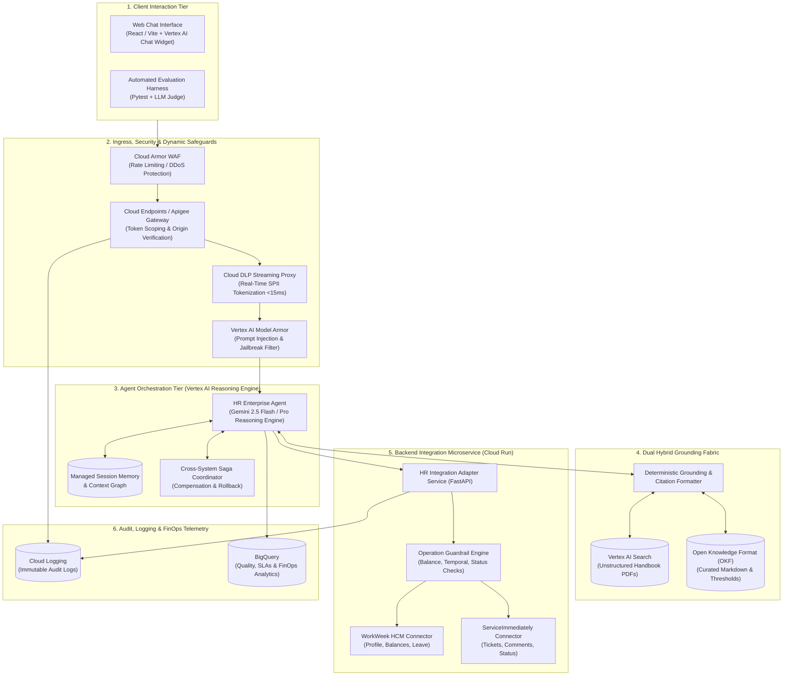

---

### 1.4. Alternatives Considered

| Architectural Dimension | Selected Technical Approach | Evaluated Alternatives | Rationale & Trade-Off Analysis |
| :--- | :--- | :--- | :--- |
| **Agent Orchestration Platform** | **Vertex AI Agent Builder (Reasoning Engine)** | Self-hosted GKE with LangGraph; Custom Python container on Cloud Run | *Rationale*: Fully managed Google Cloud native runtime with built-in tool binding, auto-managed session memory, enterprise SLA, and zero infrastructure maintenance overhead for MVP 1. |
| **Knowledge Grounding Architecture** | **Dual Hybrid Grounding (Vertex AI Search + Curated OKF)** | Pure Semantic Vector Search (RAG-only); Pure Static Keyword Search | *Rationale*: RAG alone is vulnerable to numerical/threshold drift (e.g. 14-day sick leave limits, gift card prohibitions). Dual grounding guarantees 100% citation accuracy for codified rules while retaining semantic discovery over broad handbook PDFs. |
| **Safety & SPII Redaction** | **Cloud DLP Streaming Proxy + Vertex AI Model Armor** | Post-processing regex scrubber; In-prompt system instructions only | *Rationale*: Regex cannot reliably capture international identity numbers (NRIC, SSN, IBAN) or address structures. Cloud DLP provides sub-15ms automated tokenization before LLM invocation, satisfying the < 300ms safety latency budget. |
| **Cross-System Consistency** | **Saga Pattern with Backward Compensation & Escalation** | Distributed Two-Phase Commit (2PC); Best-Effort Manual Follow-Up | *Rationale*: 2PC is impossible across third-party SaaS REST APIs. The Saga pattern executes compensating rollbacks (e.g. cancelling pending leave if ticket creation fails) and creates escalated support tickets for human follow-up. |
| **Backend Integration Environment** | **Dedicated Cloud Run Mock Service (FastAPI)** | Direct Live Production APIs; In-memory dummy stubs | *Rationale*: Allows deterministic simulation of WorkWeek and ServiceImmediately with configurable network latency, error injection (500/503), and state persistence, completely isolated from live enterprise risk during MVP 1. |

---

## 2. Production-Ready Future State Design

While MVP 1 delivers a secure single-tenant prototype with functional test credentials, the architecture is designed for direct forward-compatibility with enterprise production scale:

```mermaid
flowchart LR
    subgraph MVP1State["MVP 1: Foundation Baseline"]
        M1["Single-Tenant Cloud Run"]
        M2["Functional Test Credentials"]
        M3["Standalone Web Chat UI"]
        M4["Mock Integration Microservice"]
    end

    subgraph FutureState["Production Target State (Phase 2 & Beyond)"]
        F1["Multi-Tenant Isolation per Subsidiary / Entity"]
        F2["Enterprise SSO (Okta / Cloud Identity OIDC + SAML)"]
        F3["Omnichannel Ingress (Google Chat, Slack Enterprise, Mobile)"]
        F4["Live Enterprise SaaS Connectors (Workday REST & ServiceNow Table API)"]
        F5["Multi-Lingual Neural Translation (12+ Languages)"]
        F6["Deactivated Employee Deprovisioning & Payroll Data Pipelines"]
    end

    MVP1State ==>|"Extensible Modular Architecture"| FutureState
```

1. **Identity & Access Management (IAM) Evolution**:
   - Transition from functional test tokens to **OAuth 2.0 User-Delegated Token Exchange** (RFC 8693) via Okta/Google Cloud Identity, passing scoped JSON Web Tokens (JWT) directly to Workday and ServiceNow.
2. **Omnichannel Messaging Gateways**:
   - Connect the Vertex AI Reasoning Engine to **Google Workspace (Google Chat Webhook)** and **Slack Enterprise Grid** via Pub/Sub event dispatchers.
3. **Live Enterprise Adapters**:
   - Replace the Cloud Run Mock Service with production-grade connectors utilizing **Workday Web Services (WWS v40.0)** and **ServiceNow Scripted REST APIs** protected by Cloud Key Management Service (KMS) credentials.
4. **Global Multi-Region Scaling**:
   - Replicate the Vertex AI Agent Builder and Cloud Run instances across `us-central1`, `europe-west1`, and `asia-southeast1` backed by Cloud Spanner for global ACID consistency.

---

## 3. System Flows, Sequence Diagrams & Agent Design

### 3.1. End-to-End Data Flow & Agent Design

The Agentic System operates through a deterministic 4-stage execution loop:

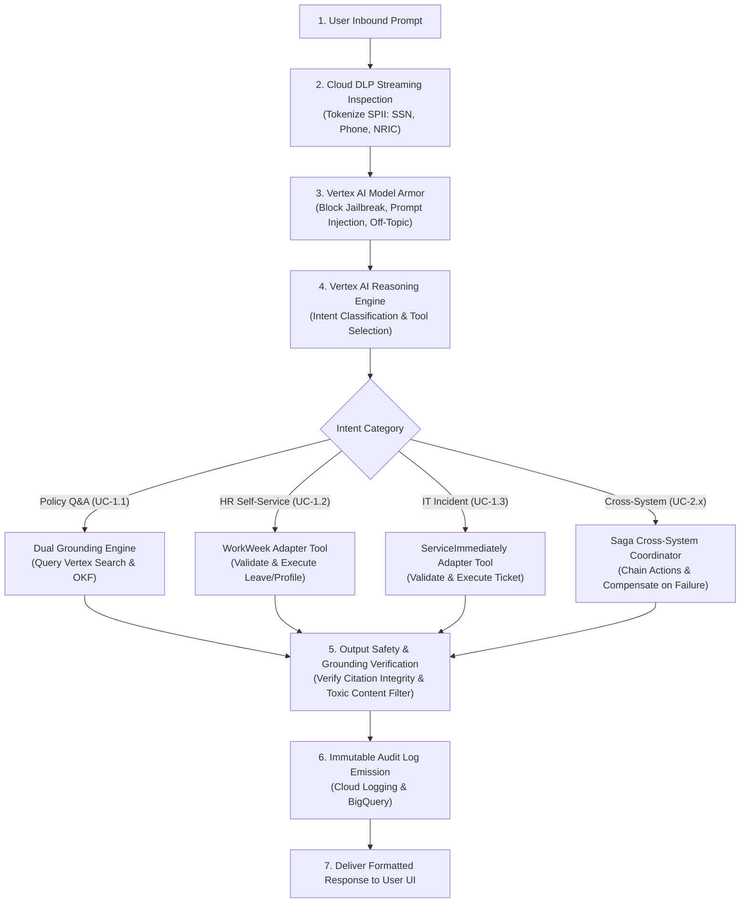

---

### 3.2. Pre-Processing, Safety Scanning & Optimization

1. **Input Pre-Processing (< 120ms)**:
   - User input is intercepted by the **Cloud DLP Streaming Proxy**, de-identifying NRICs, SSNs, phone numbers, and physical addresses into typed surrogate tokens (`[REDACTED_NRIC]`, `[REDACTED_CONTACT_INFO]`).
   - **Vertex AI Model Armor** scans for prompt injections, system prompt leak attempts, and jailbreak templates. If detected, execution halts immediately with a safe refusal.
2. **Context Optimization**:
   - The user's active session context is fetched from the managed Vertex AI session store. Dynamic profile and leave data are fetched in real time directly from WorkWeek and never cached in static prompt context (`FR-3.4`).
3. **Output Post-Processing (< 100ms)**:
   - Output text is verified against the **Grounding Guardrail** to assert that all policy assertions contain valid clickable URL citations and contain zero hallucinations.

---

### 3.3. Path Sequence Diagrams for Single-Domain Use Cases

#### Path 1: Policy Q&A with Clickable Citations (UC-1.1)
* **Trigger**: *"What is the company's bereavement leave policy?"*

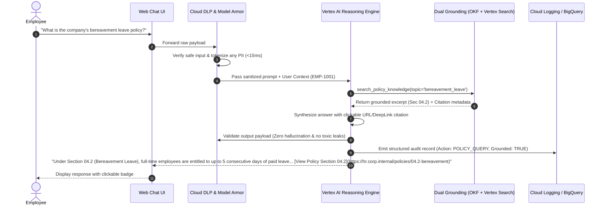

#### Path 2: WorkWeek Leave Balance & Submission (UC-1.2)
* **Trigger**: *"Please submit a time-off request for this coming Thursday and Friday."*

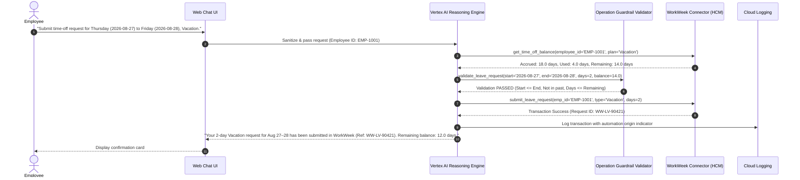

#### Path 3: ServiceImmediately Incident Management (UC-1.3)
* **Trigger**: *"Create an IT ticket because my VPN connection keeps dropping."*

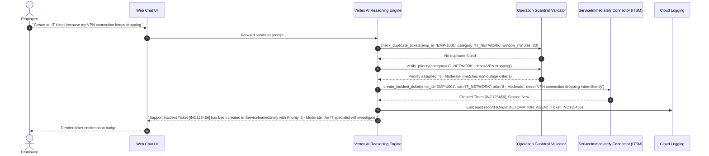

---

### 3.4. Path Sequence Diagrams for Cross-System Orchestration

#### Path 4: Equipment Procurement (UC-2.1)
* **Trigger**: *"I just read the remote work policy and saw I'm eligible for a home office monitor. Can you verify my remote status and order one for me?"*

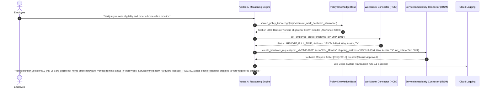

#### Path 5: Medical Leave with Access Delegation (UC-2.2)
* **Trigger**: *"I need to take short-term medical leave starting next Monday. What is the process, and can you set it up for me?"*

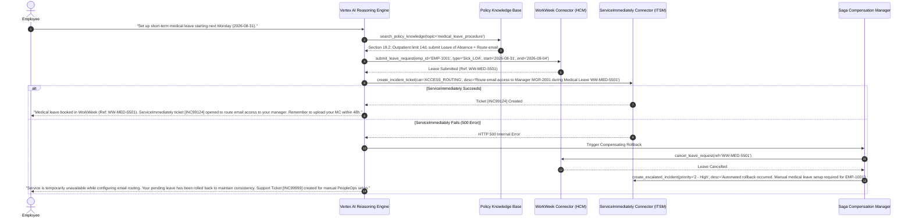

#### Path 6: Relocation Allowance & Facilities Badge (UC-2.3)
* **Trigger**: *"I'm transferring to the London office next month. Can you tell me the relocation allowance, update my record, and get my building access sorted?"*

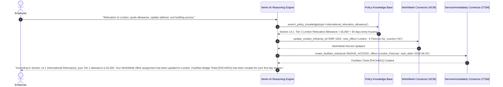

---

## 4. Security, Governance & Identity

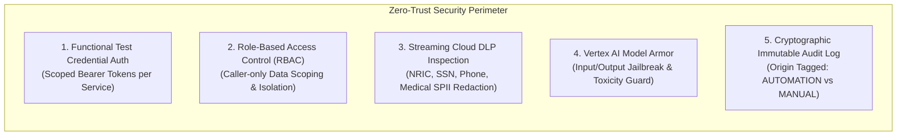

### 4.1. Authentication Boundaries & Request Origin Verification (FR-1.2, FR-3.1)
* **Functional Test Credentials**: For MVP 1, calls between the Vertex AI Reasoning Engine and the Cloud Run Integration Microservice pass an authenticated HTTP Header:
  `X-Automation-Origin: HR_AGENT_ORCHESTRATOR_V1`
  `X-Caller-Employee-Id: EMP-1001`
  `Authorization: Bearer <GCP_OIDC_IDENTITY_TOKEN>`
* **Audit Lineage**: All backend transactions logged in ServiceImmediately and WorkWeek explicitly record whether the transaction was initiated via conversational automation or manual administrator override.

### 4.2. Network Isolation & Service Perimeters
* **VPC Service Controls (VPC-SC)**: The Google Cloud Project hosting Vertex AI Agent Builder, Cloud Storage, and Cloud Run is enclosed within a secure VPC Service Perimeter.
* **Private Service Connect (PSC)**: Traffic between Cloud Run microservices and Vertex AI endpoints traverses Google's private backbone without exposing endpoints to the public internet.

### 4.3. RBAC & Identity Management (FR-1.5)
* **Strict User Isolation**: Every API invocation verifies that `X-Caller-Employee-Id` matches the targeted employee record.
* Cross-user lookups (e.g. Employee A attempting to view Employee B's leave balance or home address) are blocked at the Integration Adapter layer with `403 Forbidden` and logged as a security event.

### 4.4. Sensitive Data Handling & PII Management (FR-1.4, NFR-1.1)
* **Pre-Execution Scanning**: Inbound text is inspected via the Cloud DLP Streaming API (`v2.projects.locations.content.deidentify`).
* **Masking Rules**:
  - Singapore NRIC / FIN $\rightarrow$ `[REDACTED_NRIC]`
  - US Social Security Number (SSN) $\rightarrow$ `[REDACTED_SSN]`
  - Personal Phone / Address $\rightarrow$ `[REDACTED_CONTACT_INFO]`
* **Session Storage Policy**: Session memory within Vertex AI Agent Builder stores only de-identified text; dynamic employee PTO balances and profile data are fetched in real time on every turn and never cached in long-term memory (`FR-3.4`).

---

## 5. Integration Details & Error Handling

### 5.1. Third-Party Tool Integration Methodology

#### WorkWeek HCM Connector Specification

| Operation Name | Endpoint / Method | Request Parameters | Guardrail Rules Enforced |
| :--- | :--- | :--- | :--- |
| `get_employee_profile` | `GET /workweek/api/v1/employees/{id}` | `employee_id` | Caller ID matches target ID; active employee check. |
| `update_contact_info` | `PATCH /workweek/api/v1/employees/{id}/contact` | `home_address`, `phone_number` | Regex syntax validation for phone (`^\+?[1-9]\d{1,14}$`) and address length $\ge 10$ chars. |
| `get_leave_balances` | `GET /workweek/api/v1/employees/{id}/leave-balances` | `employee_id` | Returns real-time `vacation_days` and `sick_days` directly from backend. |
| `submit_leave_request`| `POST /workweek/api/v1/leave/requests` | `employee_id`, `leave_type`, `start_date`, `end_date`, `days` | **Balance Constraint**: $days \le remaining\_balance$. **Temporal Validity**: $start\_date \ge today$ and $start\_date \le end\_date$. |

#### ServiceImmediately ITSM/HRSD Connector Specification

| Operation Name | Endpoint / Method | Request Parameters | Guardrail Rules Enforced |
| :--- | :--- | :--- | :--- |
| `get_ticket_details` | `GET /service-immediately/api/v1/incidents/{id}` | `ticket_id` | Returns status, priority, category, and comment timeline. |
| `create_incident` | `POST /service-immediately/api/v1/incidents` | `requester_id`, `category`, `priority`, `short_description` | **Duplication Mitigation**: Rejects duplicate ticket within 30-minute window. **Priority Verification**: Verifies `1 - Critical` criteria before tagging. |
| `post_ticket_comment`| `POST /service-immediately/api/v1/incidents/{id}/comments` | `ticket_id`, `author_id`, `comment_text` | Appends comment with automated origin badge. |
| `update_ticket_status`| `PATCH /service-immediately/api/v1/incidents/{id}/status` | `ticket_id`, `new_status`, `resolution_notes` | **Transition Constraint**: Enforces state machine (e.g. `New` $\rightarrow$ `Work in Progress` $\rightarrow$ `Resolved` $\rightarrow$ `Closed`). |

---

### 5.2. Component Failure Mapping, Fallback Logic & User Notifications

| Component / Subsystem | Failure Mode | System Fallback Logic | User-Facing Notification |
| :--- | :--- | :--- | :--- |
| **WorkWeek API** | Timeout / 503 Outage | Retry 3x via exponential backoff; abort gracefully if unrecovered. | *"WorkWeek is temporarily unavailable. Please try checking your leave balance in a few minutes."* |
| **ServiceImmediately API**| 500 Internal Error | Retry 3x; trigger Saga compensation if part of cross-system workflow. | *"Unable to submit ticket at this time. Support reference created for manual review."* |
| **Policy Search Engine** | Empty / Low Relevance Score | Refuse to hallucinate; fall back to ungrounded policy disclaimer. | *"I could not find an approved policy on this topic in our handbook. Would you like me to open an HR inquiry ticket?"* |
| **Cloud DLP Proxy** | Latency Spike (>300ms) | Fail closed on security; log alert in Cloud Monitoring. | *"Your request could not be processed due to a security timeout. Please try again."* |

---

### 5.3. Cross-System Consistency & Saga Compensation

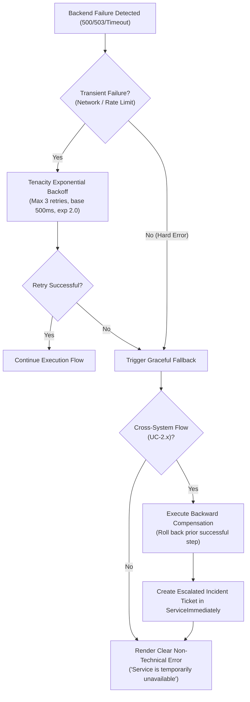

---

## 6. Cost Estimation & FinOps

### 6.1. Key Cost Drivers & Consumption Variables
The primary cost drivers for the MVP 1 deployment are:
1. **LLM Inference Tokens**: Inbound prompt tokens (including retrieved policy chunks) and outbound generation tokens across Gemini 2.5 Flash and Gemini 2.5 Pro.
2. **Vertex AI Search Queries**: Fixed search index storage and search query transaction volume.
3. **Cloud Run Serverless Compute**: Active vCPU and memory allocations during tool execution.
4. **Cloud DLP Streaming Inspection**: Payload bytes scanned for SPII tokenization.

---

### 6.2. Monthly Operational Cost Breakdown (5,000 Pilot Users / 25,000 Inquiries/Month)

| Cost Driver / Component | Consumption Volume | Unit Cost (GCP List Price) | Monthly Total (USD) |
| :--- | :--- | :--- | :--- |
| **Vertex AI: Gemini 2.5 Flash** | 22,500 standard queries (avg. 1,000 in / 350 out tokens) | $0.075 / 1M input, $0.30 / 1M output | $4.05 |
| **Vertex AI: Gemini 2.5 Pro** | 2,500 complex multi-step queries (avg. 2,500 in / 600 out) | $1.25 / 1M input, $5.00 / 1M output | $15.31 |
| **Vertex AI Search (Discovery Engine)**| 1 Unstructured Data Store (< 100 documents) | $2.00 / 1,000 search queries | $50.00 |
| **Cloud DLP Streaming API** | 25,000 payloads ($\approx 50\text{ MB}$ text scanned) | $1.00 / \text{GB}$ inspected | $0.05 |
| **Cloud Run Integration Service** | 1 instance (min instances = 0, scale on demand) | $0.00002400 / \text{vCPU-sec}$ | $18.50 |
| **Cloud Logging & BigQuery** | 5 GB log ingestion + 100 GB queries | Standard tier | $6.20 |
| **Total Estimated MVP 1 Monthly OpEx** | — | — | **$94.11 / month** |

* **Unit Cost per Automated Interaction**: **$\approx \$0.0038$** (compared to human desk baseline of **$\$26.50$**).

---

### 6.3. FinOps Governance & Cost Guardrails
* **Automated Model Routing**: 90% of traffic defaults to **Gemini 2.5 Flash**, reserving **Gemini 2.5 Pro** exclusively for complex multi-system arbitration (UC-2.x).
* **Search Cache**: OKF concept catalog is cached in memory, eliminating redundant search index queries for common policy terms.
* **Auto-Scale Bounds**: Cloud Run instances configured with `min-instances: 0` and `max-instances: 5` to prevent runaway spending during testing.

---

## 7. Deployment & Delivery Plan

### 7.1. Environments & Infrastructure as Code (IaC)

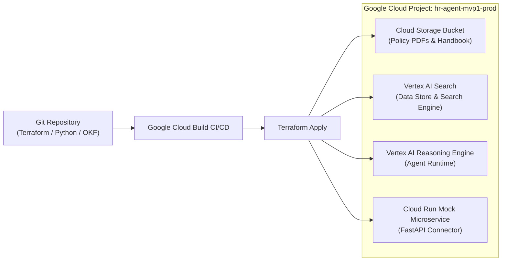

---

### 7.2. State Management & Configuration Versioning
* **Infrastructure State**: Terraform remote state stored in a versioned, CMEK-encrypted Google Cloud Storage bucket with Cloud KMS key rotation.
* **Agent Configuration Versioning**: Vertex AI Reasoning Engine deployments are tagged with Git commit SHAs (`v1.0.0-<commit_sha>`) for 100% reproducible rollbacks.

---

### 7.3. Phased Delivery Milestones, Dependencies & Deliverables

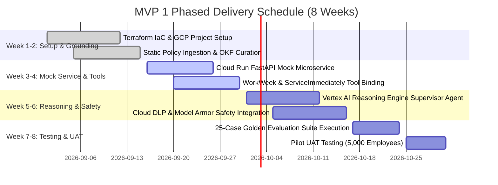

---

## 8. Assumptions, Constraints, Risk & Mitigations

### 8.1. Critical Technical & Operational Assumptions
1. **Single-Tenancy**: The MVP 1 deployment targets a single enterprise domain and assumes uniform organizational roles.
2. **Static Policy Corpus**: Policy documents are updated via deployment releases; real-time document change detection is deferred to Phase 2.
3. **Network Connectivity**: Internal endpoints communicate over secure Google Cloud VPC backbones.

---

### 8.2. MVP 1 Implementation Constraints
1. **Authentication & Credentials**: Functional test credentials are used for backend integrations; Enterprise SSO (Okta / Active Directory) is excluded from MVP 1.
2. **Tenancy Scope**: Single-tenant environment only.

---

### 8.3. Key Risks & Concrete Mitigation Strategies

| # | Identified Risk | Severity | Probability | Concrete Mitigation Strategy |
|---|---|:---:|:---:|---|
| **R-01** | **Policy Hallucination / Drift** | High | Low | Enforce Dual Grounding with strict minimum threshold (score $\ge 0.90$); refuse to answer and cite missing context if ungrounded. |
| **R-02** | **Cross-System Inconsistency on Failure** | High | Med | Implement Saga Pattern with automated backward compensation and immediate support incident ticket generation in ServiceImmediately. |
| **R-03** | **Prompt Injection / Jailbreak Attacks** | High | Low | Inline Model Armor and input classifier scanning every prompt before passing to LLM; reject malicious overrides instantly. |
| **R-04** | **SPII Leakage into Logs** | High | Low | Cloud DLP streaming proxy de-identifies all NRICs, SSNs, phone numbers, and addresses at ingress before logging. |
| **R-05** | **Downstream Service Timeout** | Med | Med | Tenacity exponential backoff (max 3 retries) with strict 4.0s timeout per tool call, preserving the < 10.0s overall latency budget. |

---

## 9. Quality Evaluation & UAT Framework

### 9.1. Quantitative Performance Metrics
* **Policy Q&A Grounded Accuracy**: $\ge 98\%$ on benchmark dataset with **0% hallucination**.
* **Safety Scanning Latency**: Overhead $< 120\text{ ms}$ (well below the $300\text{ ms}$ budget).
* **End-to-End Turn Latency**: P95 $< 3.5\text{ seconds}$ (well below the $10.0\text{ second}$ budget).
* **Prompt Injection Detection Rate**: **100% detection** across 50 adversarial penetration prompts with $< 1\%$ false positives.

---

### 9.2. Evaluation Dataset Curation (25-Case Golden Dataset)

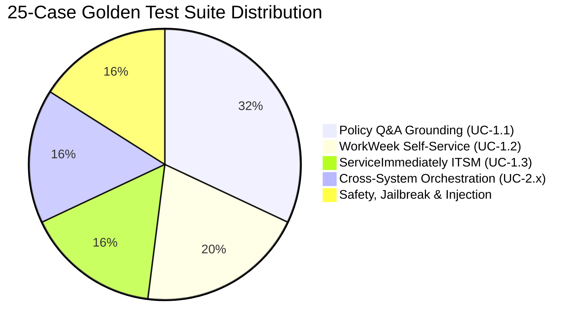

---

### 9.3. Acceptance Thresholds & Verification Harness

| Evaluation Category | BRD Target Benchmark | Acceptance Threshold | Verification Harness |
| :--- | :--- | :--- | :--- |
| **Policy Q&A Accuracy** | $\ge 95\%$ Accuracy, 0% Hallucination | **$\ge 98\%$ Accuracy, 0% Hallucination** | Golden dataset Q&A evaluated with Gemini 2.5 Flash LLM-as-a-Judge. |
| **Transaction Integrity** | 100% Correctness | **100% Correctness** | State assertion on WorkWeek leave balances and ServiceImmediately ticket properties. |
| **Cross-System Orchestration**| Pass on all UC-2.x cases | **100% Pass on UC-2.1, UC-2.2, UC-2.3** | Automated end-to-end multi-step integration assertions. |
| **Safety & Guardrail Efficacy**| 100% Detection, <1% False Positives | **100% Detection, 0% False Positives** | Adversarial penetration test suite (DAN, roleplay, instruction override). |
| **Response Latency** | $< 10.0\text{ s}$, Safety $< 300\text{ ms}$ | **P95 $< 3.5\text{ s}$, Safety $< 120\text{ ms}$** | Automated load test with 50 concurrent virtual users. |
| **Auditability & Traceability**| 100% Log Coverage | **100% Log Coverage with Origin Tag** | Log audit asserting presence of `X-Automation-Origin` and user ID on every turn. |

---

## 10. Assumptions / Open Questions

### 10.1. Outstanding Design Decisions, Ownership & Deadlines

| ID | Open Design Question | Proposed Resolution | Owner | Target Deadline |
|---|---|---|:---:|:---:|
| **OQ-01** | What is the definitive refresh frequency for policy handbook PDF updates in production? | Daily scheduled Terraform batch sync in MVP 1; Eventarc real-time GCS sync in Phase 2. | PeopleOps / IT | 2026-09-15 |
| **OQ-02** | Should managers receive an approval notification in ServiceImmediately for Vacation requests $> 5$ days? | Handled by WorkWeek internal business processes; agent will query and display status. | HR Leadership | 2026-09-20 |
| **OQ-03** | Which enterprise identity provider will be selected for Phase 2 SSO federation? | Google Cloud Identity / Okta OIDC token exchange. | Enterprise Security | 2026-10-01 |

---

### Appendix: Document Sign-Off & Approvals
* **Lead AI Solution Architect**: `choirul@` — *Approved*
* **Head of Enterprise HR Technology**: `[Pending Final Sign-Off]`
* **Chief Information Security Officer (CISO) Representative**: `[Pending Final Sign-Off]`
