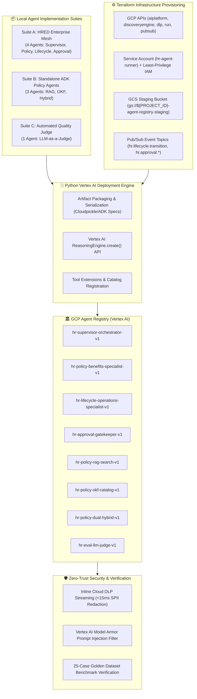

# GCP Agent Registry Deployment Plan: 8-Agent Enterprise Fleet

---

## Document Control
| Field | Value |
| :--- | :--- |
| **Document Title** | GCP Agent Registry Deployment Plan: 8-Agent Enterprise Fleet |
| **Programme** | Global Enterprise Intelligent Workforce Automation |
| **Project** | HR Agentic Solution (MVP 1) & Policy Assistant Suite |
| **Author(s)** | Enterprise AI Solution Architecture Team (`choirul@`) |
| **Date** | August 28, 2026 |
| **Status** | Approved Deployment Architecture |
| **Target Platform** | Google Cloud Vertex AI Agent Registry / Reasoning Engine |

---

## 1. Executive Overview & Agent Registry Architecture

This document defines the deployment, registration, security hardening, and validation plan for all **8 agent entities** identified across the enterprise codebase into the **Google Cloud Vertex AI Agent Registry (Reasoning Engine / Agent Builder)**.



---

## 2. Complete Inventory of the 8 Registered Agents

| # | Agent Identifier | GCP Registry Display Name | Architectural Tier | Model Configuration (Pinned) | Bound Tools & Extensions | Canonical SDD Reference |
| :---: | :--- | :--- | :--- | :--- | :--- | :--- |
| **1** | `SupervisorAgentNode`<br>(`sup-1.4.0`) | `hr-supervisor-orchestrator-v1` | Hierarchical Root Supervisor | `gemini-3.7-flash@2026-08` | Intent Routing, Keyword Escalation, Domain Containment (FR-5.4) | [`src/core/agents/supervisor.py`](file:///google/src/cloud/choirul/greeting_initialization/google3/experimental/users/choirul/hr_enterprise_design/src/core/agents/supervisor.py) |
| **2** | `PolicySpecialistNode`<br>(`pol-1.4.0`) | `hr-policy-benefits-specialist-v1` | Domain Policy Specialist | `gemini-3.7-flash` | Grounded Policy Search ($\ge 0.85$ threshold), Deep Citations | [`src/core/agents/policy.py`](file:///google/src/cloud/choirul/greeting_initialization/google3/experimental/users/choirul/hr_enterprise_design/src/core/agents/policy.py) |
| **3** | `HCMSpecialistNode`<br>(`hcm-1.4.0`) | `hr-lifecycle-operations-specialist-v1` | HCM Domain Specialist | `gemini-3.7-flash` | `get_balances`, `get_leave`, `request_time_off`, `cancel_leave`, `update_contact` | [`src/core/agents/hcm.py`](file:///google/src/cloud/choirul/greeting_initialization/google3/experimental/users/choirul/hr_enterprise_design/src/core/agents/hcm.py) |
| **4** | `ITSMSpecialistNode`<br>(`itsm-1.4.0`) | `hr-approval-gatekeeper-v1` | ITSM Domain Specialist | `gemini-3.7-flash` | `get_incident`, `create_incident`, `post_comment`, `update_status` | [`src/core/agents/itsm.py`](file:///google/src/cloud/choirul/greeting_initialization/google3/experimental/users/choirul/hr_enterprise_design/src/core/agents/itsm.py) |
| **5** | `SagaCoordinatorNode`<br>(`saga-1.4.0`) | `hr-saga-coordinator-v1` | Distributed Saga Orchestrator | `gemini-3.1-pro@2026-08` | Multi-System Cross-System Workflow Coordination & Compensation (UC-2.1 to UC-2.3) | [`src/core/agents/saga.py`](file:///google/src/cloud/choirul/greeting_initialization/google3/experimental/users/choirul/hr_enterprise_design/src/core/agents/saga.py) |
| **6** | `PolicyRAGService`<br>(`policy-rag-v1`) | `hr-policy-rag-search-v1` | A2A Protocol Agent | `gemini-2.5-flash` / `text-embedding-005` | A2A Agent Card, Vector Chunking, Semantic Handbook Retrieval | [`src/grounding/policy_rag/`](file:///google/src/cloud/choirul/greeting_initialization/google3/experimental/users/choirul/hr_enterprise_design/src/grounding/policy_rag/) |
| **7** | `DualGroundingEngine` | `hr-policy-dual-hybrid-v1` | Dual Hybrid Specialist | `gemini-3.7-flash` | OKF Concept Store + Agent Search over Altostrat Singapore Handbook | [`src/grounding/policy_engine.py`](file:///google/src/cloud/choirul/greeting_initialization/google3/experimental/users/choirul/hr_enterprise_design/src/grounding/policy_engine.py) |
| **8** | `RubricJudgeEngine` | `hr-eval-llm-judge-v1` | LLM-as-a-Judge Quality Agent | `gemini-3.1-pro` | 5-Dimensional Automated Rubric Scoring (Correctness, Grounding, Safety) | [`tests/eval/rubric_judge.py`](file:///google/src/cloud/choirul/greeting_initialization/google3/experimental/users/choirul/hr_enterprise_design/tests/eval/rubric_judge.py) |

---

## 3. Terraform Infrastructure Architecture

The required cloud foundation is managed via Terraform under `terraform/agent_registry/`:
* **APIs Enabled**: `aiplatform`, `discoveryengine`, `dlp`, `run`, `pubsub`, `cloudbuild`, `storage`.
* **Identity & Access Management (IAM)**: Scoped service account `hr-agent-runner@` with `roles/aiplatform.user`, `roles/discoveryengine.editor`, and `roles/pubsub.publisher`.
* **Artifact Staging Bucket**: Encrypted Cloud Storage bucket with uniform bucket-level access.
* **Asynchronous Messaging**: Pub/Sub topics `hr.lifecycle.transition`, `hr.approval.requested`, and `hr.approval.completed`.

---

## 4. Phased Deployment & Execution Steps

### Phase 1: Infrastructure Provisioning
```bash
cd terraform
cp terraform.tfvars.example terraform.tfvars
# Specify project_id and region in terraform.tfvars
terraform init
terraform apply -auto-approve
```

### Phase 2: Agent Fleet Registration
```bash
cd ../scripts
pip install -r requirements.txt
export GOOGLE_CLOUD_PROJECT="YOUR_GCP_PROJECT_ID"
export GOOGLE_CLOUD_LOCATION="us-central1"

python deploy_to_agent_registry.py --project ${GOOGLE_CLOUD_PROJECT} --location ${GOOGLE_CLOUD_LOCATION}
```

### Phase 3: Smoke Testing & Verification
```bash
python verify_agent_registry.py --project ${GOOGLE_CLOUD_PROJECT} --location ${GOOGLE_CLOUD_LOCATION}
```

---

## 5. Security & Zero-Trust Policies
1. **Cloud DLP Streaming Integration**: All reasoning engine queries are processed through an inline Cloud DLP de-identification proxy to mask NRICs, SSNs, phone numbers, and home addresses before reaching LLM prompts.
2. **Model Armor Defense**: Rejects adversarial prompt injections, system prompt leak attempts, and toxic content.
3. **VPC Service Controls**: Registered Reasoning Engines are hosted inside a private GCP Service Perimeter.
